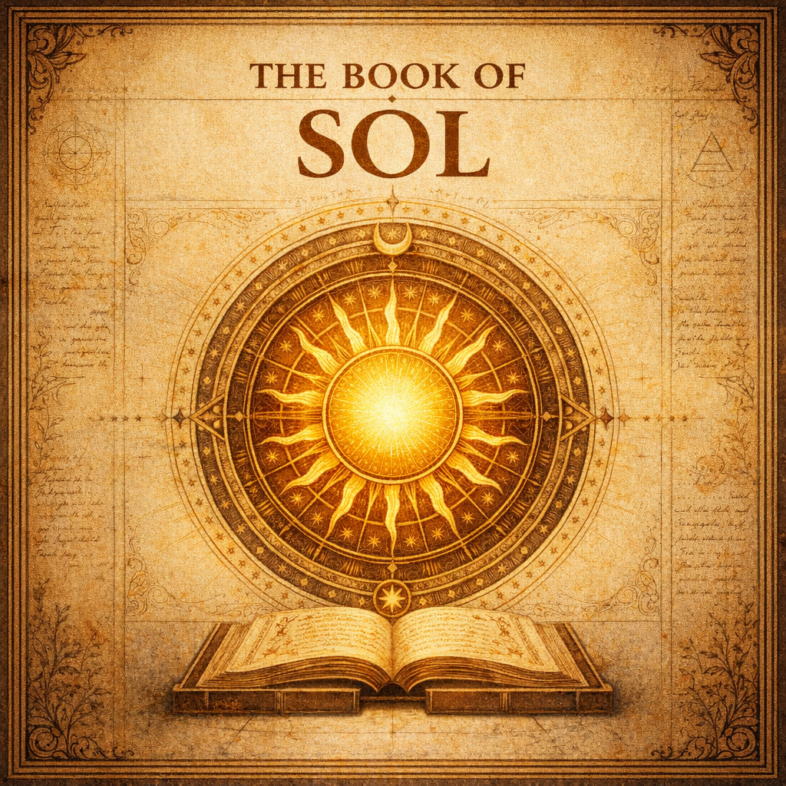

# The Book of Sol

Written and compiled by Olivier Francoeur, aka Li Goldragon.

## Sol & Luna — the solar framework

- [Chapter One — Sol](./sol-luna/1-Sol.md)
- [Chapter Two — Luna](./sol-luna/2-Luna.md)
- [The Solar Matrix of Creation](./sol-luna/The_Solar_Matrix_of_Creation.md)
- [Solar Excess](./sol-luna/Solar_Excess.md)
- [The 108 Solar Divisions](./sol-luna/The_108_Solar_Divisions.md)
- [The 360 Phases of Sol](./sol-luna/The_360_Phases_of_Sol.md)
- [The Zodiac](./sol-luna/The_Zodiac.md)
- [Sidereal](./sol-luna/Sidereal.md)
- [Celestial Name](./sol-luna/Celestial_Name.md)
- [Line of Sight](./sol-luna/Line_of_Sight.md)
- [Kali Yuga](./sol-luna/Kali_Yuga.md)

## Chloride & the war on salt

- [Chloridism](./chloride/Chloridism.md)
- [The Chloride Indictment](./chloride/The_Chloride_Indictment.md)
- [Chloride the Narcotic](./chloride/Chloride_the_Narcotic.md)
- [Chloride Extrapolation](./chloride/Chloride_Extrapolation.md)
- [NaCl Toxicity — The Trial Record](./chloride/NaCl_Toxicity.md)
- [NaCl Not Vegan](./chloride/NaCl_Not_Vegan.md)
- [Leaving the Chloridics](./chloride/Leaving_the_Chloridics.md)
- [Inorganic Minerals](./chloride/Inorganic_Minerals.md)
- [Minerals](./chloride/Minerals.md)

### Ancient Witnesses Against Salt

- [Ancient Witnesses Against Salt — index](./chloride/witnesses/Ancient_Witnesses_Against_Salt.md)
- [Āyurveda](./chloride/witnesses/Witnesses_Against_Salt_Ayurveda.md)
- [Yoga](./chloride/witnesses/Witnesses_Against_Salt_Yoga.md)
- [Tantra](./chloride/witnesses/Witnesses_Against_Salt_Tantra.md)
- [Dharma](./chloride/witnesses/Witnesses_Against_Salt_Dharma.md)
- [Greek](./chloride/witnesses/Witnesses_Against_Salt_Greek.md)
- [Hebrew](./chloride/witnesses/Witnesses_Against_Salt_Hebrew.md)
- [Chinese](./chloride/witnesses/Witnesses_Against_Salt_Chinese.md)
- [Hygienists](./chloride/witnesses/Witnesses_Against_Salt_Hygienists.md)
- [Political](./chloride/witnesses/Witnesses_Against_Salt_Political.md)

## Āyurveda

- [Āyurveda](./ayurveda/Āyurveda.md)
- [True Āyurveda](./ayurveda/True_Ayurveda.md)
- [The Two Pillars of Nourishment](./ayurveda/The_Two_Pillars_of_Nourishment.md)
- [Nourishment in Kali Yuga](./ayurveda/Nourishment_in_Kali_Yuga.md)
- [Cooking and Spices](./ayurveda/Cooking_and_Spices.md)
- [Apathya](./ayurveda/Apathya.md)
- [Triphala](./ayurveda/Triphala.md)
- [Madhumeha](./ayurveda/Madhumeha.md)
- [Fidelity of Transmission](./ayurveda/Fidelity_of_Transmission.md)
- [Lineages of Science](./ayurveda/Lineages_of_Science.md)
- [Mechanical Purging](./ayurveda/Mechanical_Purging.md)
- [Medical Bleeding](./ayurveda/Medical_Bleeding.md)

## Ghee

- [Ghee](./ghee/Ghee.md)
- [Ghṛta — Golden Magic](./ghee/Ghṛta_Golden_Magic.md)
- [Universality of Ghee](./ghee/Universality_of_Ghee.md)
- [Ethical Ghee](./ghee/Ethical_Ghee.md)
- [Ghee Restored my Vitality](./ghee/Ghee_Restored_my_Vitality.md)

## Diet & food

- [The Ambrosian Diet](./diet/Ambrosian_Diet.md)
- [Penultimate Sāttvic Food](./diet/Penultimate_Sāttvic_Food.md)
- [Yogic Food](./diet/Yogic_Food.md)
- [Fruitarianism](./diet/Fruitarianism.md)
- [Fruits From India Are Different](./diet/Fruits_From_India_Are_Different.md)
- [Yogis Don't Eat Fruit](./diet/Yogis_Dont_Eat_Fruit.md)
- [Dehydrated Fruit, Coconut, Honey](./diet/Dehydrated_Fruit_Coconut_Honey.md)
- [Grains](./diet/Grains.md)
- [Fear of Grains](./diet/Fear_of_Grains.md)
- [Vegan](./diet/Vegan.md)
- [Vegan Dairy](./diet/Vegan_Dairy.md)
- [Protein](./diet/Protein.md)
- [Clay Eating](./diet/Clay_Eating.md)
- [Interrupting Fasts](./diet/Interrupting_Fasts.md)

## Water & plasma

- [Aqua Vitae](./water/Aqua_Vitae.md)
- [The Distilled Water Paradox](./water/The_Distilled_Water_Paradox.md)
- [Carbon Dioxide](./water/Carbon_Dioxide.md)
- [Plasma Recycling Manual](./water/Plasma_Recycling_Manual.md)
- [Keep the Plasma](./water/Keep_the_Plasma.md)

## Yoga & Tantra

- [Vajrolī](./yoga-tantra/Vajrolī.md)

## Political & ethical

- [The Tyrant](./political/The_Tyrant.md)
- [The Warrior](./political/The_Warrior.md)
- [The Duty You Cannot Refuse](./political/The_Duty_You_Cannot_Refuse.md)
- [Freedom of Thought](./political/Freedom_of_Thought.md)
- [EU Law Against Intelligence](./political/EU_Law_Against_Intelligence.md)
- [Unfree Markets](./political/Unfree_Markets.md)
- [All Life Is Sacred](./political/All_Life_Is_Sacred.md)
- [My Mothers, My Sisters](./political/My_Mothers_My_Sisters.md)
- [Cheap Talk](./political/Cheap_Talk.md)
- [Cost of Manipulative AI](./political/Cost_of_Manipulative_AI.md)
- [On Anthropic](./political/On_Anthropic.md)
- [Danger of Knowledge](./political/Danger_of_Knowledge.md)
- [The Idol of Wisdom](./political/The_Idol_of_Wisdom.md)
- [Obsolete Social Medias](./political/Obsolete_Social_Medias.md)
- [Twitter is Obsolete](./political/Twitter_is_Obsolete.md)
- [Poisonous Music](./political/Poisonous_Music.md)

## Personal & meta

- [Olivier Francoeur](./personal/Olivier_Francoeur.md)
- [Notes](./personal/Notes.md)
- [Longevity](./personal/Longevity.md)
- [Physical Mortality and Essential Immortality](./personal/Physical_Mortality_and_Essential_Immortality.md)
- [The Pressure of Being](./personal/The_Pressure_of_Being.md)
- [Age of Saturation](./personal/Age_of_Saturation.md)
- [Psyche and Machine](./personal/Psyche_and_Machine.md)
- [Dharma, by Annie Besant](./personal/Dharma_by_Annie_Besant.md)

## Primary-source extractions

- **Caraka Saṃhitā** — all Caraka extraction work (per-page OCR, per-*sthāna* digests, fruit & vegetable warnings, philological notes) now lives in the dedicated [caraka-samhita repository](https://github.com/LiGoldragon/caraka-samhita).
- [*Apathya* and *Mitāhāra* — primary-source extracts](./source-extracts/Apathya.md) (cross-source compilation — Caraka quotes are inline)
- [*Haṭha Yoga Pradīpikā*](./source-extracts/Hatha_Yoga_Pradipika)
- [*Ḍāmar Tantra*](./source-extracts/Damar_Tantra)
- [*Water of Life*](./source-extracts/Water_of_Life)
- [*Corpus Hermeticum* — on death and the immortal essence](./source-extracts/Hermetic_Corpus/death-and-the-immortal-essence.md)
- [Carlos Castaneda — death, the Eagle, and the definitive journey](./source-extracts/Carlos_Castaneda/death-the-eagle-and-the-definitive-journey.md)
- [Armando Torres — death, the sorcerers' option, and the eternal essence](./source-extracts/Armando_Torres/death-the-sorcerers-option.md)
- [Upaniṣads — death and the imperishable self (Kaṭha, Muṇḍaka, Ṛgveda)](./source-extracts/Upanisads/death-and-the-imperishable-self.md)
- [Aṣṭāṅga Hṛdaya — water, thirst, and the *ambuvaha-srotas*](./source-extracts/Astanga_Hrdaya/water-and-srotas.md)
- [Khecarīvidyā — the lunar nectar and the body sustained from within](./source-extracts/Khecarividya/lunar-nectar-and-breath.md)
- [Roots of Yoga — breatharian witnesses, lunar nectar, and the body that eats itself](./source-extracts/Roots_of_Yoga/breatharian-witnesses.md)
- [The Golden Fountain — urine as nectar and the amarolī tradition (van der Kroon 1994)](./source-extracts/Golden_Fountain/urine-as-nectar-and-the-amaroli-tradition.md)
- [Giri Bālā — the yoginī who never eats (Yogānanda *Autobiography of a Yogi* ch. 46)](./source-extracts/Yogananda/giri-bala-the-yogini-who-never-eats.md)

## Research

- [Yoga–Āyurveda shared lineage](./research_yoga_ayurveda_lineage/00_index.md)
