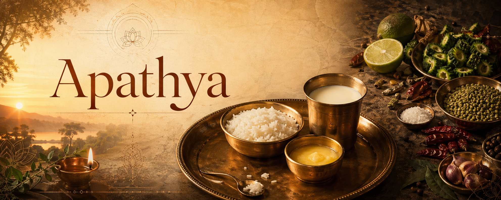

# Apathya

## *What Ayurveda actually forbids on the plate, and why almost every modern recipe marketed as "Ayurvedic" gets it wrong*

## A recipe that is almost everywhere

Open almost any book, blog, or Instagram feed marketed today under the heading *Ayurvedic cooking*, and you will find some version of the same recipe. Half a cup of split mung beans. A diced zucchini. Half a cup of coconut milk. A tablespoon of lime juice. A spoon of ghee or coconut oil. Turmeric, ground coriander, ground cumin. Salt to taste. A cilantro garnish on top. Simmered together in one pot, finished with another squeeze of lime "for brightness," served with rice or flatbread on the side. The cookbook tells you this plate is *healing*. It tells you the spices *awaken digestion*. It tells you this is what Ayurveda teaches.

The primary texts of Ayurveda — the medical and yogic treatises written down roughly two thousand years ago — say something very different. They give an explicit list of what should not be eaten daily, and they call that list **apathya**: food "not suited to the path" of health. Read against their list, the modern recipe is the assembled negative image of what the tradition recommends, clause by clause.

The essay translates and glosses what Ayurveda actually teaches about food, in the words of its own physicians and yogis, then sets the modern recipe against those teachings. Two errors in the recipe matter most. The first is that it contains too many ingredients. The second is that it is built around **chloride of sodium** — which, whether sold as table salt, sea salt, rock salt, pink Himalayan salt, Celtic salt, kosher salt, or *fleur de sel*, is the same chemical compound, a compound the classical texts classify as an inorganic poison alongside lead. These two errors alone are enough to disqualify the plate as Ayurvedic food, whatever the cookbook calls it. The remaining problems in the recipe — and there are several — only accelerate the damage.

## Who is speaking: a short tour of the texts

Before any argument, the voices in it are worth naming. The essay quotes six classical texts. Each appears several times; the reader benefits from knowing briefly who wrote it and when.

**Āyurveda** — literally *āyur-veda*, "the knowledge of life" — is the Indian medical tradition. Its canon is three treatises, known collectively as the *bṛhat-trayī*, the "Great Three":

- The ***Caraka Saṃhitā*** (c. 100 BCE – 200 CE, attributed to the physician Caraka) is the oldest and most cited. It is the foundational clinical text of Ayurveda, written by a named physician for named students, and covers physiology, pharmacology, diet, and therapeutic practice in eight sections (*sthāna*).
- The ***Suśruta Saṃhitā*** (roughly contemporary, attributed to the surgeon Suśruta) is the surgical compendium, with additional chapters on disease etiology.
- The ***Aṣṭāṅga Hṛdaya*** of Vāgbhaṭa (c. 600 CE) is the synthesizing compendium that harmonizes the two older texts.

These three are the canonical Ayurvedic corpus. A passage from any of the three carries the weight of clinical doctrine, not folk opinion.

From the yogic side, two central manuals address diet directly.

- The ***Haṭha Yoga Pradīpikā*** (fifteenth century, by Svātmārāma) is the most widely cited hatha yoga text. Its first chapter names specifically what the yogi should and should not eat.
- The ***Gheraṇḍa Saṃhitā*** and ***Śiva Saṃhitā*** (roughly contemporary with the Pradīpikā) repeat Svātmārāma's positions in nearly identical vocabulary.

And from the dharmic-philosophical corpus, the ***Bhagavad Gītā*** — in its seventeenth chapter — gives a typology of food that names the same categories, in nearly the same order, as the yogic and medical texts.

When six texts across three traditions (medical, yogic, philosophical) converge on a specific dietary teaching — as they do on the list of forbidden foods — they speak with one voice. This is the shared doctrine of the Indo-Aryan dietary tradition.

## The Ayurvedic idea of food in one paragraph

A few foundational concepts carry the argument.

**Agni** is the digestive fire. Ayurveda treats every meal as fuel offered to this fire, which transforms food into tissue (*dhātu*) through a sequence of stages. A well-kindled agni digests cleanly. A weak or overwhelmed agni produces **āma** — undigested residue — which accumulates in the channels (*srotas*) as the material basis of most chronic disease.

The **three doṣas** — *vāta* (movement), *pitta* (transformation), *kapha* (structure) — are the three biological principles of classical Indian physiology. Health is their balance. Disease is their imbalance.

The **six rasas** or tastes — *madhura* (sweet), *amla* (sour), *lavaṇa* (salty), *kaṭu* (pungent), *tikta* (bitter), *kaṣāya* (astringent) — are Ayurveda's pharmacological classification of flavor. Each taste has predictable effects on the doṣas, on agni, and on the tissues. *Madhura* is the one taste the classical texts treat as wholly suited to daily food. The others are admitted in measured quantity or as medicine.

**Ojas** is the refined end-product of good digestion: the essence that gives strength, immunity, luminosity of complexion, and longevity. The purpose of a wholesome diet is ultimately to build *ojas*.

The health-goal of all of this is **svastha** — "one established in one's own being," the healthy person, defined by Caraka in a single verse:

> **sama-doṣaḥ samāgniś ca sama-dhātu-mala-kriyaḥ |**\
> **prasanna-ātmendriya-manāḥ svastha ity abhidhīyate ||**
>
> "Even in the doṣas, even in agni, even in the functioning of the tissues and wastes,\
> serene in self, senses, and mind —\
> this is called *svastha*, the healthy one."\
> — *Caraka Saṃhitā*, Sūtrasthāna 15.48

Every plate is ultimately measured against this verse. Does the meal keep the doṣas in balance? Keep agni strong? Keep the tissues nourished? Keep the mind serene? If yes, it is *pathya* — suited to the path. If no, it is *apathya* — not.

## What is *pathya*: unctuous, sweet, measured

The positive register of the classical plate is captured in a single compound: **snigdha-madhura**. *Snigdha* means unctuous, held together with fat — in the classical tradition, that fat is ghee (*ghṛta*, clarified butter), not oil. *Madhura* means sweet, in the specifically classical sense that includes cooked grain, milk, ghee, and fully cooked pulses, not only sugary foods.

Svātmārāma's foundational yogic diet-verse states the rule:

> **susnigdha-madhurāhāraś caturthāṃśa-vivarjitaḥ |**\
> **bhujyate śiva-samprītyai mitāhāraḥ sa ucyate ||**
>
> "Food that is unctuous and sweet, eaten so that one-quarter of the stomach is left empty,\
> offered to please Śiva —\
> this is called *mitāhāra*, measured eating."\
> — *Haṭha Yoga Pradīpikā* 1.58

Three elements define the plate:

- **Unctuous** (*snigdha*) — held together with ghee.
- **Sweet** (*madhura*) — grain-based, milk-based, not sharp or sour or pungent.
- **Measured** (*mita*) — in quantity, leaving the stomach a quarter empty so agni has room to work.

Vāgbhaṭa, the medical synthesizer, gives the same standard in clinical terms:

> **uṣṇaṁ snigdhaṁ mātrāvad ajīrṇe'nupasevitam |**\
> **agniṁ dīpayati āhāraḥ samyak tu bala-vardhanaḥ ||**
>
> "Food taken warm, unctuous, in proper measure,\
> and not during indigestion,\
> kindles agni and nourishes strength."\
> — *Aṣṭāṅga Hṛdaya*, Sūtrasthāna 8

Warm, unctuous, measured. Eaten when the previous meal has fully digested. These four adjectives — plus Svātmārāma's *madhura* — define the positive register. The classical plate is rich in ghee, milk, and cooked grain — restrained, warm, and few in its ingredients.

## What is *apathya*: the forbidden list

The classical texts do not leave the prohibition to implication. They give the list in plain words. The most-cited yogic statement is the verse that immediately follows Svātmārāma's definition of *mitāhāra*:

> **kaṭvamla-tīkṣṇa-lavaṇoṣṇa-harita-śāka-sauvīra-taila-tila-sarṣapa-madya-matsyān |**\
> **ajādi-māṃsa-dadhi-takra-kulattha-kola-piṇyāka-hiṅgu-laśunādyam apathyam āhuḥ ||**
>
> "The pungent, the sour, the sharp, the salty, the hot,\
> green vegetables, sour gruel, oil, sesame, mustard, alcohol, fish,\
> goat and other flesh, curds, buttermilk, horse-gram, jujube,\
> oil-cake, asafoetida, garlic, and the like —\
> these they call unwholesome."\
> — *Haṭha Yoga Pradīpikā* 1.59

The phrase *apathyam āhuḥ* — "they call it unwholesome" — is the technical formula. Five tastes are named:

- **kaṭu** — pungent (chilies, mustard, excess ginger, excess pepper, garlic)
- **amla** — sour (lime juice, tamarind, vinegar, fermented foods)
- **tīkṣṇa** — sharp / piercing (asafoetida, raw garlic, excess alcohol)
- **lavaṇa** — salty (any salt used immoderately)
- **uṣṇa** — hot (in the sense of heating, pungent heat, not just temperature)

A sixth category is added: *harita-śāka* — raw leafy greens. And then a list of specific substances, from sesame and mustard to fish, flesh, curds, buttermilk, jujube, asafoetida, and garlic.

The *Bhagavad Gītā* states essentially the same list in a different register — as the food signature of *rajas*, the quality of agitation:

> **kaṭv-amla-lavaṇāty-uṣṇa-tīkṣṇa-rūkṣa-vidāhinaḥ |**\
> **āhārā rājasasyeṣṭā duḥkha-śokāmaya-pradāḥ ||**
>
> "Foods that are pungent, sour, salty, excessively hot, sharp, dry, and burning\
> are dear to those of agitated nature.\
> Such foods bring forth sorrow, grief, and disease."\
> — *Bhagavad Gītā* 17.9

Six of the same tastes, in nearly the same order — and now with named consequences: *duḥkha, śoka, āmaya* (sorrow, grief, disease). The *Gheraṇḍa Saṃhitā* (5.21) and *Śiva Saṃhitā* (3.33) give the same prohibition in nearly identical vocabulary. Four classical texts, across yogic and dharmic traditions, converge on one list.

On the medical side, Caraka makes the point through his pharmacology of taste. Each of the six rasas, he teaches, is beneficial in measured use and harmful in excess. Here is his verdict on the salty taste in excess, to take one example:

> **lavaṇasyātiyogāt puṁstvopaghāta\
> indriyopaghāto vali-palita-khālityaṃ ca bhavati ||**
>
> "From excess of the salty taste comes loss of virility,\
> impairment of the senses,\
> and the production of wrinkles, greying, and baldness."\
> — *Caraka Saṃhitā*, Sūtrasthāna 26.43(3)

The fuller passage lists heart-disease, skin disease, premature ageing, internal bleeding, and alopecia as consequences of chronic salt intake. Vāgbhaṭa itemizes the same injuries with the precision of a modern clinical summary:

> **atisevitas tu asra-pavana-kopano\
> dehasya dauḥśīlya-vali-palita-khālitya-\
> tṛṣṇā-kuṣṭha-viṣa-visarpa-balakṣayān karoti ||**
>
> "Used in excess, salt causes increase of blood and wind;\
> it produces coarseness of the body, wrinkles of the skin,\
> greying of the hair, baldness, thirst,\
> skin diseases, the action of poisons, herpes,\
> and the diminution of bodily strength."\
> — *Aṣṭāṅga Hṛdaya*, Sūtrasthāna 10.12–13

This is the Indo-Aryan diet-doctrine in short. The plate that keeps you *svastha* is *snigdha-madhura* and *mita* — unctuous, sweet, measured. The plate that takes you off the path is *kaṭu-amla-tīkṣṇa-lavaṇa-uṣṇa* — pungent, sour, sharp, salty, hot — plus raw greens, plus a list of specific substances.

## The first error: too many ingredients

The modern recipe has eleven ingredients. The classical plate has three.

This is the largest failure in the genre, and it precedes any discussion of specific substances. The staple preparations named throughout the Ayurvedic Sūtrasthāna are uniformly minimal:

- **Yūṣa** — cooked mung, thinned with water, finished with ghee. Two ingredients plus water.
- **Kṛśarā** — rice and mung cooked together in water with ghee. *Kṛśarā* is the classical ancestor of what modern cookbooks call "kitchari." Three ingredients.
- **Pāyasa** — rice cooked slowly in milk, finished with a small measure of sweet. Three ingredients.
- **Yavāgū** — grain thinned with water and ghee. Two to three ingredients.
- **Vilēpī** — thicker rice porridge with water and ghee. Three ingredients.

Three. Never eleven. The modern "Ayurvedic" recipe has mung, water, zucchini, coconut milk, lime juice, turmeric, coriander, cumin, ghee-or-coconut-oil, salt, and cilantro. It departs from the central discipline of classical eating.

The classical cook was conservative with ingredients because agni — the digestive fire — has a finite processing budget. Each ingredient has its own *rasa* (taste), its own *vīrya* (heating or cooling potency), its own *vipāka* (post-digestive effect). When two or three ingredients combine, the cook can predict how agni will respond. When eleven combine, the interactions become combinatorial: every additional ingredient introduces a fresh axis on which the meal can fail.

Caraka treats this problem formally under the doctrine of *viruddha-anna* — "antagonistic food." The canonical passage names *sixteen* distinct axes on which a combination can become pathogenic: place, time, digestive capacity, quantity, habituation, doṣa, processing, potency, bowel condition, sequence, treatment, cooking, combination, palatability, quality, method. At eleven ingredients, the probability of at least one axis going wrong approaches certainty.

The project's thesis on this point, stated in [*True Āyurveda*](./True_Ayurveda.md):

> *The simultaneous ingestion of many herbs sends conflicting signals at once, obscuring feedback and defeating discrimination... True Āyurveda therefore begins with subtraction.*

This is what *mita* in *mitāhāra* means. *Mita* covers measure in the count of things on the plate, in quantity, in pacing. The classical plate is three or four items, cleanly cooked, given to agni without simultaneous competing signals. Eleven ingredients in one bowl abandons the principle. Before any of the eleven is examined for its own properties, the plate has already stopped being Ayurvedic food simply by the count of its inputs.

## The second error: salt as inorganic poison

The line in the recipe reads "salt to taste." Two words. By the classical doctrine this is the most immediately damaging instruction on the page, and the conclusion holds **regardless of which variety of salt the cook reaches for**. Table salt, sea salt, rock salt, "pink Himalayan salt," Celtic grey salt, *fleur de sel*, kosher salt, black salt, flaked salt: every one of these is the same chemical compound — **chloride of sodium** (NaCl) — differing only in crystal size, trace minerals, and the marketing story printed on the package. The toxicological agent is the chloride anion; the color of the crystal and the brand on the label are irrelevant. Ayurveda's teaching on the harm of *lavaṇa* in excess applies to all of them identically.

An entire wellness industry now rests on the opposite claim — that coloured, "unrefined," "ancient," "full-spectrum" salts are a healthy alternative to white table salt, and may therefore be poured freely on an "Ayurvedic" plate. The claim is chemically false and doctrinally false. The classical tradition already refuted it two thousand years before it was made.

### The classical eight-fold salt classification — and what it actually says

Ayurveda distinguishes *eight* varieties of *lavaṇa* (salt). Vāgbhaṭa lists them and then, critically, puts the whole set in the same taxonomic group as lead:

> "*Varaṁ (saindhava), sauvarcala, kṛṣṇa (biḍa), sāmudra, audbhida, romaka, pāṃsuja* —\
> all these are *lavaṇas* or salts —\
> **sīsa (lead) and kṣāra (alkalies) form the salt group.**"\
> — *Aṣṭāṅga Hṛdaya*, Sūtrasthāna 6.147, trans. K. R. Srikantha Murthy

Vāgbhaṭa groups all of them — the eight salts, lead, and lye — in *a single classificatory category*: concentrated inorganic mineral. The classical physician looked at rock salt, sea salt, pit salt, earth-salt, the salts of the Punjab, and lead, and saw them as surface varieties of one underlying category. From the perspective of what the body is asked to process, the distinctions between them were small, and their shared kinship with lead and alkali was what mattered.

Modern chemistry confirms the verdict in its own vocabulary. Every dietary salt in today's kitchen — regardless of provenance, color, or price — is between 97% and 99% **chloride of sodium** (NaCl). The remaining 1–3% is trace minerals that give the crystal its color and its premium shelf tag. Those trace minerals account entirely for the marketing story ("Himalayan," "Celtic," "volcanic," "hand-harvested"); they do not change the identity of the compound. The ion-load delivered into plasma is, within 2–3%, identical whether the crystal came from the Mediterranean, Pakistan, Bolivia, Brittany, or an industrial processing plant. When Vāgbhaṭa says salt causes *asra-pavana-kopa* (aggravation of blood and wind), *vali, palita, khālitya, tṛṣṇā, kuṣṭha, visarpa, bala-kṣaya* (wrinkles, greying, baldness, thirst, skin disease, herpes, loss of strength), he is describing the action of the chloride anion. That action does not change because the crystal is pink rather than white.

### The category principle: inorganic mineral cannot feed a living body

The deeper classical position is that inorganic mineral, as a category, cannot feed a living organism. Only matter that has passed through life — grain ripened through the plant, milk produced by the cow, honey gathered by the bee — is biologically compatible. Mineral in its inorganic form is ***jaḍa***: lifeless. The body cannot assimilate it; it can only discharge it at cost.

Caraka states the principle in a single verse on the eating of earth and metal:

> **mṛttikā-loha-bhakṣaṇaṃ tamo-nimittam ||**
>
> "The eating of earth and metal arises from *tamas* —\
> from inertia and the obscuration of intelligence."\
> — *Caraka Saṃhitā* (doctrinal formulation, Sūtrasthāna tradition)

*Tamas* is the third of the three qualities (*triguṇa*) in classical Indian thought — the quality of inertia, darkness, the failure of discrimination. Caraka's verse places the ingestion of inorganic mineral squarely in *tamas*: an act rooted in obscuration, a breakdown of the intelligence that would otherwise distinguish food from non-food.

Every dietary salt sold today falls under this verse. The pink crystal mined from Pakistan, the grey crystal raked from Brittany, the white crystal extracted from seawater and refined in Germany — all of them are crystallized chloride of sodium, concentrated inorganic mineral, delivered in a form the body cannot assimilate through any living matrix. The body responds to all of them the same way: by irritation. Thirst. Elevated blood pressure. Disturbed kidney function. Progressive vascular stiffening. The sensations salt produces — heightened appetite, transient alertness, a sense of being "charged up" — are *defensive reactions to the irritation of inorganic material in the plasma*, misread as nourishment.

The project's linguistic position on this compound, developed in the companion article [Chloridism](../chloride/Chloridism.md), is that the Romance-language naming — *chlorure de sodium*, *cloruro di sodio*, "chloride of sodium" — is more accurate than the English "sodium chloride," because the active toxic principle is the chloride anion, not the sodium cation. The full toxicological case is given in [The Chloride Indictment](../chloride/The_Chloride_Indictment.md). The Ayurvedic record in full is in [Witnesses Against Salt — Āyurveda](../chloride/witnesses/Witnesses_Against_Salt_Ayurveda.md).

### The practical upshot

When the recipe says "salt to taste" — and when the cookbook reader defaults to whatever salt is on the shelf, from iodized table salt to boutique pink crystal sold at a premium — three things are happening at once:

1. The compound in question is **chloride of sodium**, regardless of the label. The chemistry is the same across every variety marketed as "salt," "sea salt," "rock salt," "pink salt," "Himalayan salt," "Celtic salt," *fleur de sel*, "kosher salt," or "volcanic salt." All of them are 97–99% NaCl.
2. It is being added unmeasured — *to taste* — a pattern no classical text authorizes. Whatever the variety, the *rasa-atiyoga* verdict of Caraka and Vāgbhaṭa attaches to quantity-at-the-palate, not to the crystal's origin.
3. The compound itself is ***jaḍa*** — inorganic matter, placed by Vāgbhaṭa in the same classificatory group as lead, and by Caraka in the company of *tamas*-driven acts like clay-eating.

Taken together, these three facts are enough — by the tradition's own doctrine, and by modern chemistry's confirmation of it — to remove the recipe from the category of Ayurvedic food. No amount of turmeric, mung, ghee, or cilantro can compensate. No commercial swap from "table salt" to "Himalayan pink salt" rescues it. The chloride-of-sodium instruction alone is disqualifying.

## The remaining errors, more briefly

The two errors above are sufficient. The rest of the recipe compounds the damage along specific axes the tradition has named. Each deserves a short treatment.

**The lime juice, added twice** introduces *amla rasa* (sour taste) at a concentration Caraka's pharmacology forbids. Sour in excess — Caraka's verdict at Sū. 26.43(2) — sensitises teeth, aggravates pitta, causes burning in throat and chest. *Amla* is one of the five excluded tastes in the apathya verse above.

**The coconut milk combined with ghee and lime** triggers the doctrine of *viruddha-anna* (antagonistic combination). Caraka explicitly names coconut (*nārikela*) in the list of fruits that must not be combined with milk or milk-derivatives:

> **... āmra-āmrātaka-mātuluṅga... nārikela-dāḍima-āmalakāni ...**\
> **payasā saha viruddham ||**
>
> "Mango, wild mango, citron... coconut, pomegranate, Indian gooseberry —\
> these fruits and similar substances, and all sour liquids,\
> are antagonistic (*viruddha*) with milk."\
> — *Caraka Saṃhitā*, Sūtrasthāna 26.84

Coconut with milk-derived fat is on the explicit antagonism list. The modern recipe's combination — coconut milk + ghee + lime in one pot — assembles three forms of *viruddha* at once.

**"Ghee or coconut oil"** collapses a classical hierarchy. Ghee (*ghṛta*) is *sarpiṣāṃ paramam*, "the first among fats" — specifically elevated over oil in the canonical text:

> "Cow ghee promotes memory, intelligence, agni, semen, ojas, *kapha*, and *medas*;\
> alleviates *vāta*, *pitta*, poison, insanity, phthisis, and fever.\
> **It is the best of all fats**..."\
> — *Caraka Saṃhitā*, Sūtrasthāna 27.231–233

Oil (*taila*) appears on the apathya list itself, in the HYP 1.59 verse quoted earlier. Treating ghee and coconut oil as interchangeable ignores the classical distinction entirely.

**The zucchini, diced and added raw** violates a specific three-step rule for the gourd family (*trapusa, ervāruka, alābu* in the classical taxonomy — modern New World cucurbits fall here by analogy). The rule, stated at Caraka Sū. 27: *boil the gourd, express the juice, and add fat before serving.* All three steps. The modern recipe performs none of them; it dices the zucchini and simmers it with the dāl, expressed liquid intact.

**The "bloomed spices" — turmeric, coriander, cumin** are classified, in Ayurveda's taxonomy, as *auṣadha* (medicine). Caraka's Sūtrasthāna groups them with emetics, purgatives, and anthelmintics — administered with specific indications, in specific doses, for specific durations. Daily, indefinite "blooming" of these substances at every meal converts medicine into diet, which Caraka himself identifies as the path by which the best drug becomes the sharpest poison:

> "A sharp poison also becomes the best drug by proper administration;\
> on the contrary, even the best drug is reduced to sharp poison,\
> if administered badly."\
> — *Caraka Saṃhitā*, Sūtrasthāna 1.126

**The cilantro garnish** is *harita-śāka* — raw leafy green herb — which the HYP 1.59 verse names explicitly on the apathya list alongside the five excluded tastes. It is the last category on the prohibition, and the last item on the recipe.

## The recipe against the verdict

Laid out as a summary table, the mapping is mechanical.

| Instruction in the recipe | Ayurvedic classification | Source |
|---|---|---|
| Split mung dāl | *Mudga* — daily food, admitted | Caraka Sū. 5.12 |
| Diced zucchini, simmered | Gourd family requires boil + press + fat | Caraka Sū. 27 |
| Coconut milk + ghee + lime | *Viruddha* — antagonistic combination | Caraka Sū. 26.84 |
| Lime juice (twice) | *Amla* excess | Caraka Sū. 26.43(2); HYP 1.59 |
| Turmeric / coriander / cumin, daily | *Auṣadha* served as *āhāra* | Caraka Sū. 1.126 |
| Ghee or coconut oil | *Taila* substituted for *ghṛta* | Caraka Sū. 27.231–234; HYP 1.59 |
| Salt to taste | *Jaḍa* — inorganic poison, same group as lead | Caraka *mṛttikā-loha*; AH 6.147 |
| Cilantro garnish | *Harita-śāka apathya* | HYP 1.59 |

Of eleven inputs, one (*mudga*) is unconditionally admitted by the classical texts. The remaining ten each violate the corpus on one or more axes. The plate is a comprehensive inversion of the classical meal — an assembly of its prohibitions rather than its practices.

## What the classical plate actually is

The inventory is short. Rice and other grains (*ṣaṣṭika*, *śāli*, barley). Mung (*mudga*) and other pulses. *Āmalaka* (Indian gooseberry). Rainwater. Milk, ghee, honey. A few items drawn at a time from this list.

The classical preparations are short, simple, warm:

- *Yūṣa* — mung thinned with water and ghee.
- *Kṛśarā* — mung and rice cooked together with ghee. The classical ancestor of "kitchari."
- *Pāyasa* — rice slow-cooked in milk with a little sweet.
- *Vilēpī* — rice porridge with water and ghee.

Two to three ingredients per preparation. Cooked until soft. Served warm. Eaten in measured quantity with one-quarter of the stomach left empty. Offered, in Svātmārāma's phrase, "to please Śiva" — meaning ritually, attentively, without distraction.

This is the plate the texts authorize. Rich in ghee and milk. Nourishing, warming, stabilizing. It stands opposite to a raw salad loaded with chilies and lime, and opposite to a complicated pot of eleven things all going in at once.

## The word *apathya*, one last time

*Apathya* is a technical term. It names a category with a defined content — five tastes, a sixth category of raw greens, a list of specific substances, and (in the medical extension) any substance that combines antagonistically with another or is administered without indication. The category is closed and the list is stable across texts.

The two most serious occupants of the category, for the modern recipe under discussion, are *count* and *chloride*. The recipe assembles too many things in one pot — breaking the classical principle of *mitāhāra*, measured eating. And it pours, unmeasured, a compound the tradition classifies alongside lead — an inorganic mineral the Ayurvedic frame identifies as *jaḍa*, lifeless matter outside the living field. Everything else is damage accelerated along specific further axes, each named by Caraka or Svātmārāma in the verses cited above.

The restoration required comes down to two adjectives and one verb: *snigdha-madhura*, *mita*. Unctuous, sweet, measured. Rice with ghee. Mung with ghee. Rice with milk. Warm, cooked through, few ingredients, eaten attentively. This is what the tradition calls food. The modern "Ayurvedic" recipe, as currently written, is *apathya* — and the classical texts have said so in their own words for two thousand years.

The primary-source extracts used in this essay — with full Sanskrit, English translation, and chapter-and-verse citation for each passage — are collected in [*Apathya* and *Mitāhāra* — Primary-Source Extracts](../source-extracts/Apathya.md).
