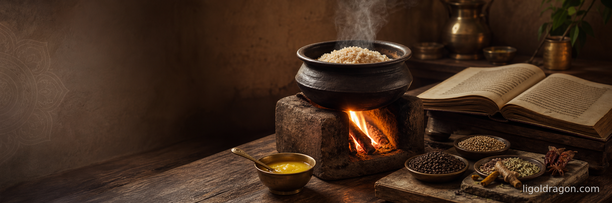

# Cooking and Spices

## Two popular aphorisms the classical corpus does not authorize

Two claims circulate today under the banner of Āyurveda that the primary corpus does not support. The first says that cooking destroys prāṇa in food, and that raw food is therefore more alive. The second says that Āyurveda prescribes a diet heavy in spices, and that pungency is the signature of its cuisine. Both survive on repetition. Both collapse the moment the śāstra is read on its own terms.

## That cooking "kills life in food"

The claim rests on a category mistake. It imagines prāṇa as a delicate thermal substance hovering in the tissue of the raw vegetable, which heat drives out. No classical text of Āyurveda or Yoga describes prāṇa this way. Prāṇa is the ordering capacity that the living organism applies to what it takes in; it is not a property the plant carries separately from being eaten. The Upaniṣads are explicit on the direction of flow.

> **annaṁ brahmeti vyajānāt**
>
> "He knew food as Brahman."\
> — *Taittirīya Upaniṣad* 3.2

> **amṛtaṁ vai prāṇāḥ**
>
> "Prāṇa itself is amṛta."\
> — *Bṛhadāraṇyaka Upaniṣad*

Prāṇa is what the eater makes of anna. It is not a ghost in the stalk that escapes when flame touches the pan.

The classical frame is structural. External cooking and internal cooking are the same operation, continuous with one another. The *pāka* at the stove is the first stage of an inner *pāka* at the digestive fire. Caraka treats digestion itself as a cooking process across stages. The *annavaha-srotas* receives what has already been cooked once; the body's *agni* cooks it a second time into rasa, and then again and again through the sequence of *dhātu-pāka* until the residue is *ojas*. The kitchen and the stomach are the same instrument in two hands.

Caraka's teaching on agni is unambiguous: food only becomes body to the extent that agni can complete the cooking.

> **rogāḥ sarve'pi mandāgnau**
>
> "All diseases arise where agni is weak."\
> — proverbial formulation, after *Aṣṭāṅga Hṛdaya* Sūtrasthāna 12

The opposite also holds. Food that has been prepared — softened, warmed, rendered digestible by external fire — reduces the labor agni must perform and gives up its rasa cleanly. Food that has not been prepared is categorized in Caraka and Suśruta under *guru* (heavy) and, when taken in quantity, as a producer of *āma* — undigested residue that accumulates as the material basis of disease.

To claim cooking "kills prāṇa" is to invert the doctrine. Cooking is the first stage by which prāṇa is made available. The raw vegetable that has not been prepared is not more alive; it is less available. Prāṇa does not diminish in the eater when food is cooked; prāṇa is precisely what rises in the eater when cooked food is properly digested.

The Vedic image survives throughout. Fire is not the destroyer of food — fire is its first recipient and elevator. The *yajña* is the whole template. Food offered to agni is not reduced to waste; it is raised into a subtler register. The same movement repeats in the body: every meal is an internal *agnihotra*. The organism is a fire-offering. To cook is to begin the offering.

The raw-food claim has no Vedic precedent and no classical Ayurvedic text behind it. It is a recent import, largely from twentieth-century European and American naturopathy, retrofitted onto a tradition that teaches the opposite.

## That Āyurveda "prescribes a lot of spices"

The second claim fails on a cleaner textual ground. The two foundational diet-verses of the Yogic-Ayurvedic tradition say the opposite of what the modern assumption presumes.

Svātmārāma's definition of measured eating (*mitāhāra*) in the *Haṭha Yoga Pradīpikā*:

> **susnigdha-madhurāhāraś caturthāṃśa-vivarjitaḥ |**\
> **bhujyate śiva-samprītyai mitāhāraḥ sa ucyate ||**
>
> "Eating food that is unctuous (*snigdha*) and sweet (*madhura*), leaving a fourth of the stomach empty, offered to please Śiva — this is called measured eating."\
> — *Haṭha Yoga Pradīpikā* 1.58

The discipline of eating is *snigdha-madhura*. Unctuous and sweet. It is not pungent, not sharp, not bitter, not salty. The next verse names the excluded tastes without apology.

> **kaṭvamla-tīkṣṇa-lavaṇoṣṇa-harita-śāka... apathyam āhuḥ**
>
> "Pungent, sour, sharp, salty, hot, green herbs... these they call unwholesome."\
> — *Haṭha Yoga Pradīpikā* 1.59

Two of the four tastes excluded in this list — *kaṭu* (pungent) and *tīkṣṇa* (sharp) — are the defining registers of what modern cookbooks market as "Ayurvedic spice." Chilies, black pepper in excess, dried ginger in excess, mustard, asafoetida, and garlic fall here. The Yogic-Ayurvedic discipline rules them out of the daily diet. The *Gheraṇḍa Saṃhitā* 5.21 repeats the prohibition in nearly identical vocabulary. The *Śiva Saṃhitā* 3.33 places the same tastes on a list alongside moral obstructions. There is no classical diet-verse in the Yogic corpus that recommends a diet of spice.

On the Ayurvedic side the picture is the same. Caraka enumerates six tastes — *madhura, amla, lavaṇa, kaṭu, tikta, kaṣāya* — but he enumerates them as *rasas* for diagnosis and therapy, not as daily prescriptions. *Kaṭu* and *tīkṣṇa* are explicitly described as aggravators of *vāta* and *pitta* and, in excess, as depleters of *śukra* and *ojas*. This is the *Sūtrasthāna* position throughout the chapters on taste (26–27): pungent and sharp are not foods but corrective agents.

What the modern "Ayurvedic" cookbook calls a *spice blend* the classical text calls a *medicament* — *auṣadha*, *bhaiṣajya*. Pungent and sharp substances are the raw material of *cikitsā* (corrective treatment), not of *āhāra* (food). They are administered in defined quantity, for defined duration, for defined conditions, then withdrawn. Caraka is vehement on the point that medicine turned into daily diet becomes its own disease. The whole logic of dose and timing that organizes the Sūtrasthāna falls apart when a corrective is made a staple.

The classical Ayurvedic meal is not a plate of spices. It is rice, *ghṛta*, seasonal grain, seasonal fruit, milk where permitted, and a discipline of quantity. The *yūṣa* of cooked pulses with minimal seasoning, the *kṛśarā* of rice and dāl, the *pāyasa* of milk and rice — these are the templates. The verse on *mitāhāra* describes a plate that anyone raised on a modern "Ayurvedic restaurant" menu would not recognize as Ayurvedic at all.

## The double confusion

The two errors reinforce one another. The raw-food claim suggests that cooked food is deadened and must be "brought back to life" by aggressive seasoning. The spice claim suggests that Āyurveda's signature is pungent flavor. Together they produce the modern image of "Ayurvedic cuisine" as a raw salad buried under chilies, ginger, garlic, lemon, and black pepper — a plate that violates every classical diet-verse at once. The raw base violates the doctrine of agni; the spice load violates the doctrine of *mitāhāra*.

Both errors read Āyurveda through later regional cuisine or through Western raw-food ideology, rather than through the śāstra. The primary texts prescribe a different plate:

- Food cooked until agni can receive it without labor
- A dominant register of *snigdha* (unctuous) and *madhura* (sweet)
- *Ghṛta* as the primary cooking medium
- Quantity measured, not flavor amplified
- Pungent and sharp tastes held back for corrective use, not daily consumption

This is not austere. It is sāttvic. It allows agni to do its work without constant provocation, allows *ojas* to accumulate rather than be drained, and allows the eater to remain what Caraka himself names as the condition of health:

> **sama-doṣaḥ samāgniś ca sama-dhātu-mala-kriyaḥ |**\
> **prasanna-ātmendriya-manāḥ svastha ity abhidhīyate ||**
>
> "Even in doṣas, even in agni, even in the functions of dhātus and malas, with a serene self, serenity in the senses and in the mind — this is called svastha, the healthy one."\
> — *Caraka Saṃhitā*, Sūtrasthāna 15.48 (numbering varies by edition)

A plate of aggressive spice is not the path to a serene agni. A plate of raw matter straining a weak fire is not the path to a serene digestion. The tradition is clear on what it wants: cooking, measure, unction, sweetness, quiet. These are not the signatures of some austere monastic program imposed from outside. They are the native Ayurvedic position, stated without ambiguity in the opening Sūtrasthāna of every major text.

To restore the classical picture is not to reform an exotic tradition. It is to let the tradition speak in its own words. When it does, the raw-food claim and the spice claim disappear — not because they have been refuted by argument, but because they were never classical in the first place.
