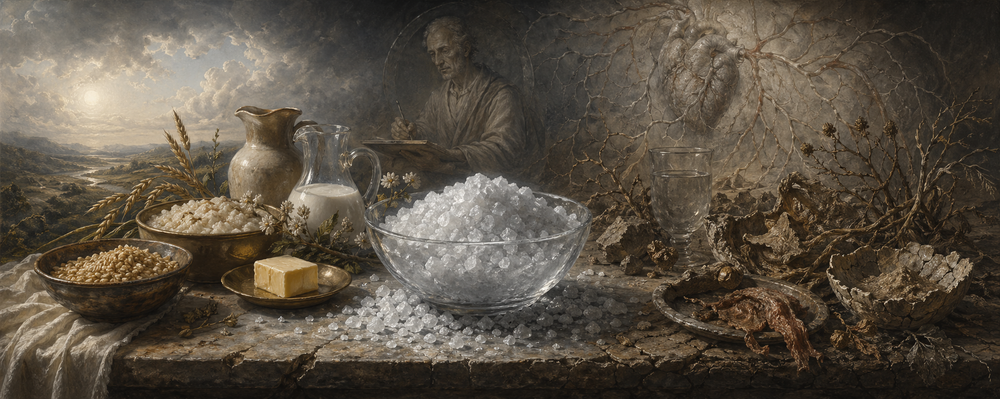

# The Chloride Indictment

## *On the Poison That Civilization Learned to Love*

### I. The Crime Against the Living Body

A poison normalized by habit is still a poison. A toxin distributed across meals is still a toxin. A narcotic defended by custom is still a narcotic. This essay sets down, in plain order and with the witnesses assembled, the case that has been gathering for two centuries: that chloride of sodium, misnamed "salt" and falsely promoted as "electrolyte," is a protoplasmic irritant, a vascular toxin, a renal burden, a nervous agitant, and a social narcotic — and that its use is sustained not by proof of benefit but by the inertia of a civilization that cannot bear to examine its own staple.

The argument does not depend on metaphor, mysticism, or novelty. Every premise is drawn from the published record of orthodox medicine, from classical clinical observation, from controlled experiment, from population data, and from the testimony of traditions older than chemistry. What follows is not a new claim. It is an old claim finally assembled, fully witnessed, and refused the shelter of euphemism.

### II. The Linguistic Deception

The compound NaCl is named in English "sodium chloride." In the Romance languages it is named with greater precision — *chlorure de sodium*, *cloruro de sodio*, *cloruro di sodio* — "chloride of sodium." The distinction is not grammatical. It is diagnostic. Sodium is a cation the body buffers; chloride is the anion that drives the injury. By foregrounding sodium, English vocabulary obscures the agent and protects the toxin.

When the compound dissociates in plasma, chloride expands extracellular volume, suppresses renin activity, stiffens vascular walls, agitates nervous signaling, and imposes osmotic stress on renal tissue. The substitution experiments of Kurtz and Morris (*J. Clin. Invest.*, 1983) and Schmidlin et al. (*Hypertension*, 2007) settle which component does the damage: when sodium is delivered as bicarbonate or citrate rather than as chloride, the pathological effects attenuate or vanish. The toxic behavior tracks the chloride-bearing compound, not sodium in abstraction.

To name the agent accurately, one must say chloride. To describe its dietary form, one must say chloride of sodium. To describe the dietary pattern it enforces, one must say chlorinated diet. To describe the individual it conditions, one must say chloridic. To describe the civilizational syndrome it produces, one must say chloridism. The vocabulary is not ornament. It is the minimum honesty required before the evidence can be heard.

### III. The Clinical Record, Uninterrupted

**Richard Bright, 1827.** In *Reports of Medical Cases*, Bright described kidneys overwhelmed by a retained substance he could not yet name. Edema, albuminuria, cardiac enlargement, retinal change. The disease was catalogued before its cause was known.

**Fernand Widal and Adolphe Javal, 1906.** In *La cure de déchloruration dans le mal de Bright et dans quelques maladies hydropigènes* (Baillière, Paris), Widal and Javal named the retained substance explicitly: chloride. They demonstrated, patient by patient, that withdrawing chloride of sodium reversed edema and stabilized the failing kidney. The original retention was not of water; it was of chloride, and water followed it. *La cure de déchloruration* — the decontaminating cure — became the ancestor of every chloride-restriction protocol of the twentieth century, even where its paternity was later forgotten.

**Joseph Achard and Fernand Widal, 1901–1905.** Parallel French work confirmed that edema and collapse in cardiac and renal failure followed chloride burden itself. Fragile organisms could not tolerate chloride load; the substance behaved as toxin, not necessity.

**Jean Digne, 1910.** *Élimination et rétention du chlorure de sodium au cours des maladies de cœur* extended the Widal thesis from kidney to heart. The cardiac failure patient is a chloride retainer. Remove chloride, the heart recovers ground.

**Frederick Hoelzel, mid-twentieth century.** In *A Devotion to Nutrition* (Vantage Press, 1954), the Chicago physiologist summarized decades of self-experiment and laboratory work with a sentence that ought to be carved over the door of every dietetics school: *"The cause of mental and physical deficiency is due mainly to a retention of salt and water in the body."* The further observation, *"My experiments showed that salt eating, with the retention in the body of salt and water, impairs the body's functions,"* is not rhetorical. It is the conclusion of a lifetime of measurement.

**Walter Kempner, 1939–1970s.** At Duke University, Kempner reduced chloride intake to near zero in patients certified to die of malignant hypertension. Rice, fruit, sugar, vitamins; no added chloride. Hearts that had been enlarged contracted. Retinas cleared of hemorrhage. Kidneys recovered function. Blood pressures that had been uncontrollable at the highest doses of pharmacology fell to physiological levels. Photographs survive. Case records survive. The *Scientific Publications by Walter Kempner, Volume II: Radical Dietary Treatment of Vascular and Metabolic Disorders* (Gravity Press, 2004) and Barbara Newborg's *Walter Kempner and the Rice Diet: Challenging Conventional Wisdom* (2011) preserve the record in full. The pattern of those recoveries is not ambiguous. Remove chloride. Life resumes.

**Lewis K. Dahl, 1962.** In *Excessive Salt Intake and Hypertension: A Dietary and Genetic Interplay* (Brookhaven National Laboratory), Dahl bred two rat strains — salt-sensitive and salt-resistant — and fed them chloride of sodium. The salt-sensitive strain developed severe hypertension, renal injury, and early death. The salt-resistant strain was largely spared. The toxic agent was the compound; the variation was only in the body's capacity to compensate. Dahl rats have been replicated in every generation since.

**DASH-Sodium, 2001 (Sacks et al., *NEJM*).** Human metabolic-ward crossover. As chloride of sodium intake was reduced in steps, blood pressure fell in steps. No threshold of innocuous dose emerged. Every reduction produced measurable benefit.

**Trials of Hypertension Prevention (Cook et al., *BMJ*, 2007).** Long-term randomized reduction of chloride of sodium intake reduced cardiovascular events. The longer the follow-up, the clearer the benefit.

**SSaSS — Salt Substitute and Stroke Study (Neal et al., *NEJM*, 2021).** Over 20,000 participants across 600 Chinese villages. Replace ordinary chloride of sodium with a reduced-chloride substitute. Result: 14% fewer strokes, 13% fewer major cardiovascular events. The only systematic difference between the groups was the quantity of chloride ingested.

**Yanomami, Oliver et al., *Circulation*, 1975.** A population with urinary chloride excretion of approximately one millimole per day — essentially no added chloride of sodium. Blood pressure low across the lifespan. Hypertension absent as a disease.

Two centuries, five continents, every methodology that medicine has invented: metabolic ward, clinical case, population cohort, animal model, community randomized trial, anthropological survey, mechanistic substitution. The result does not vary. Where chloride burden decreases, harm decreases. Where chloride burden increases, harm increases. Within this record, no experiment has ever demonstrated that adding chloride to a true zero-intake baseline amplifies vitality, coherence, or lived strength. Such an experiment would be the precondition for calling chloride healthful. It has never been performed. The claim of benefit rests on no experiment; the claim of harm rests on thousands.

### IV. The Chemistry of the Injury

The living cell is a hydrated, electrically coherent structure. Introduce a concentrated inorganic anion into its surroundings and water leaves the cell to dilute the intruder. Introduce it repeatedly and the cell adapts by contraction, retention, and deposition. This is not a conjecture. Liebig watched it happen.

Justus von Liebig, *Animal Chemistry*, translated by Gregory: *"Fresh flesh, over which salt is strewn, is found swimming in brine after twenty-four hours, yet not a drop of water has been added. The water has been yielded by the flesh itself."* The same chemistry that cures meat for preservation operates, at lower intensity but continuously, in the living body that ingests chloride of sodium. The brine does not stay in the gut. It circulates. Every cell is, to a small degree, being cured.

G. J. Drew stated the mechanism in language that no modern physiologist has improved: *"As the salt is absorbed by the body cells, they contract from the irritation, and discharge their precious albumen and other vital elements. This causes hardened tissues, shriveled blood corpuscles, hardened blood vessels, arthritis, and produces the state called old age."* And, as to assimilation: *"Salt is so stable that it is not dissolved and utilized by the body. It is ingested as salt and excreted as salt."* The body does not eat chloride. It traffics chloride. The traffic itself is the damage.

Dr. Bouchon, synthesizing a surgical career: *"Salt is one of the worst of social poisons. Because of its use, surgeons are constantly operating for appendicitis, gastric ulcers, and liver and kidney calculus. It atrophies, dries up or hardens the tissues."*

Dr. J. E. Cummins, clinical observation: *"I knew of a case of a little girl who had a craving for salt... She had hardening of the arteries, was wrinkled and appeared old at the age of four years."*

These are not polemic statements. They are diagnostic summaries by practitioners who watched the same pattern across thousands of patients. They describe contraction, dehydration, hardening, retention, and premature aging. They describe the physiology of a slow-acting toxin whose distinctive feature is that it produces its damage while being consumed for pleasure.

### V. The Narcotic Pattern

A narcotic is defined not by euphoria but by structure: stimulation followed by depletion, relief that conceals injury, dependence that grows by the body's attempt to silence its own warning signals. Chloride of sodium fits this definition with clinical precision.

Upon ingestion, chloride irritates the mucosa, provokes salivation, and shifts fluid distribution. The organism reads this activity as alertness, grounding, or satisfaction. What is actually occurring is a defensive response to chemical insult: a transient pressurization followed by depletion. Dryness, thirst, fatigue, and craving follow. The body now requires more chloride to silence the disturbance created by the previous dose. Appetite is trained. Tolerance deepens. Preference for chloride becomes indistinguishable from identity: this food tastes right, that food tastes wrong, where "right" means sufficiently adulterated with the pressurizing agent.

The narcotic illusion is completed by pacing. Distributed across meals, chloride's toxicity is hidden behind the body's compensatory mechanisms. The average two-day intake consumed at once would produce collapse; dosed gradually, it produces only premature aging, vascular hardening, renal strain, and the slow desolation of the taste field. A poison is not transformed into a nutrient by being administered slowly. Dose distribution is an analgesic; it is not a reclassification.

This is the pattern recovery communities already describe. Alcoholics report that sobriety feels like losing friends, because alcohol had fused with humor, meals, and identity. Chloride abstention produces the same social vertigo, because chloride has fused with every food the culture calls delicious. The substance is defended not because it is beneficial but because it is co-extensive with belonging. The withdrawal that follows its removal is proof — not refutation — of its narcotic character.

### VI. The Civilizational Judgment

Long before chemistry existed, cultures that watched human behavior and physiology carefully had reached the same conclusion.

**Plutarch**, in *Isis and Osiris* (Moralia V), records that the priests of Isis excluded salt entirely from their meals. They did not moderate it. They refused it even at the table, regarding it as a contaminant of continence and clarity. Plutarch's *Table Talk* (Moralia VIII, Book V) preserves the reasoning: salt enflames appetite and disturbs the composure required for clear thought and devoted practice. The priests were not mystics performing a taboo. They were empirical observers protecting the conditions of their craft.

**Hebrew scripture** associates salt with desolation, curse, and the end of fertility: the pillar of salt at Sodom, the salted fields of Shechem, the land of wormwood and salt where nothing grows. These are not arbitrary metaphors. They encode, in narrative form, the physiological consequences of chronic chloride burden — rigidity, lifelessness, and the cessation of generative capacity.

**The Caraka Saṃhitā** names the principle directly: *mṛttikā-loha-bhakṣaṇaṃ tamaḥ-nimittam* — the ingestion of earth or metal arises from tamas, from inertia and obscuration. Inorganic minerals are *jaḍa*: lifeless matter imposed on the living field. The body responds to them by irritation, elimination, or deposition. It does not assimilate them; they are not nourishment. Chloride of sodium is the textbook case: an inorganic mineral delivered directly into plasma in concentrated form, without the transformation through living matrix that makes mineral compatible with life.

**Natural Hygiene** — Graham (*Lectures on the Science of Human Life*, 1869), Shelton (*Orthotrophy*, Hygienic System Vol. II) — continued the same observation in American English: salt is stimulant, not nutrient. It produces the appearance of appetite and energy by irritating the tissues, not by feeding them. Its removal causes the so-called cravings to subside within days, after which the cleaner taste field reveals food as it actually is.

Across Egyptian priesthood, Hebrew prophecy, Vedic medicine, and American hygienism, the judgment converges. The cultures that paid closest attention to human physiology and discipline were those most unanimous in their verdict against salt. It was modernity, and only modernity, that elected to call the substance essential. It did so without experiment, against clinical record, and in defiance of every tradition that had previously examined the question.

### VII. The Burden of Proof, Misallocated

The claim that chloride of sodium is healthy at low doses is a positive claim. It requires positive evidence. Such evidence does not exist.

No controlled experiment has compared a cohort ingesting zero added chloride against a cohort ingesting customary chloride, over sufficient duration, using endpoints of vitality — strength, clarity, endurance, emotional coherence, longevity, capacity — with appropriate nutrition delivered through living matrices in both arms. The Yanomami are the closest natural approximation, and their outcomes favor the zero-intake arm. The laboratory analogue does not exist because it has not been attempted. The professional confidence that chloride is essential rests on its absence, not on its performance.

Meanwhile, the evidence of harm scales monotonically. Every increment of intake — measured in ward, in village, in strain of rat — produces a measurable increment of damage. No rebound emerges. No hormetic bend rescues the curve. From the data that exist, the least-harm endpoint is zero. This is not proof of zero's superiority. It is the extrapolation of an uninterrupted monotonic trend. The burden of proof is on whoever claims the curve reverses at doses they have never tested.

A civilization that declares a substance essential without ever demonstrating its benefit, while accumulating thousands of demonstrations of its harm, is not practicing science. It is practicing habit under the vocabulary of science. The task of this essay is to notice that difference.

### VIII. The Ethical Consequence

Ingesting chloride of sodium is the self-administration of a substance with documented toxic and degenerative effects on the human body. A human being is an animal. An animal knowingly administering injury to an animal is, by any non-arbitrary reading of the word, abusing an animal.

Veganism, if it means opposition to animal abuse rather than a symbolic list of permitted ingredients, cannot exempt one animal species — the human — by default. Whoever claims the ethic and practices the abuse must either deny that humans are animals, deny that chloride ingestion is harmful, or rewrite veganism to mean something other than what it says. None of these moves survive honest inspection.

The point is not to widen a moral dispute. The point is to restore the ethical content to the dietary choice. Every gram of ingested chloride is an election, made inside a body, by a person, with consequences borne by that body alone — but made by an organism that has moral standing in exactly the way every other animal does. The ledger does not disappear because the abused and the abuser share a skin.

### IX. Naming the Condition

**Chloride** is the anion that drives the injury.

**Chloride of sodium** is the dietary compound that delivers it.

**Chlorinated diet** is the intake pattern saturated with the compound, falsely promoted as normal or essential.

**Chloridic** describes the individual whose physiology and appetite have been conditioned to crave the pressurization spike of chloride, who mistakes irritation for vitality, who reads stimulation as nourishment, and who reaches reflexively for more whenever the post-dose depletion returns.

**Chloridism** describes the civilizational syndrome: widespread hypertension, kidney disease, edema, obesity, early aging, emotional volatility, chronic thirst misread as hunger, and the marketing of "electrolyte" products to manage the symptoms of the first exposure — completing the narcotic loop by selling its remedy.

This vocabulary is not rhetoric. It is the minimum linguistic equipment a civilization needs if it is to speak honestly about what it is doing to itself at the dinner table.

### X. The Verdict

Across two hundred years of clinical medicine, a century of controlled experiment, four millennia of classical observation, and every mechanistic investigation that biochemistry has performed, the conclusion is one and the same.

- Chloride does not sustain life. It suppresses it.
- Chloride does not nourish. It irritates, contracts, dehydrates, hardens.
- Chloride is not an electrolyte of ordinary nutrition. It is an inorganic mineral imposed on a living system that cannot use it.
- Chloride is not merely harmful at excess. It produces its harm at every dose, with no floor below which benefit appears.
- Chloride does not merely poison; it addicts. Its own damage becomes the craving that demands its next dose.
- Chloride is not a cultural neutral. It is a civilizational narcotic, whose universality is the strongest evidence of its narcotic character, not a rebuttal of it.

The case is closed because the evidence has been closed for a century. What remained was only the refusal to name it. This essay names it. Chloride of sodium, as ordinarily ingested, is a poison. Its distribution across meals is an analgesic for its toxicity, not a transformation into nutrient. Its social universality is a symptom of capture, not a demonstration of safety. Its defenders cite no experiment because none exists. Its witnesses, from the priests of Isis to the rice-diet clinic of Walter Kempner, from Liebig's brining flesh to the Yanomami of the Amazon, all testify to one conclusion.

Remove chloride. Life resumes.

### XI. What Remains

What remains, after the argument is complete, is the practical question. Removal is not a stylistic preference. It is a discipline that runs against every social current of the chloridic civilization. The taste field will recover in days. The social field will take longer, because the removal withdraws the communicant from the shared sacrament that is the chlorinated meal.

The withdrawal will be called extremism, imbalance, and fanaticism by exactly the people whose dependency the withdrawal exposes. This is not unusual. Every narcotic defends itself through the mouths of those who still use it. The pattern is old. The warriors of the *Gītā*, the priests of Isis, the hygienists of the nineteenth century, and the clinicians of the twentieth — all faced the same social retaliation for the same refusal.

One does not argue with the retaliation. One lets the body answer.

The body answers. The heart answers. The kidneys answer. The retinas answer. The taste field answers. The life that returns answers. Every organ and faculty that had been slowly cured by the brining of plasma answers, in the only language organs speak: by resuming function.

That is the evidence that survives the culture. That is the record that will stand when the vocabulary of "electrolyte" has been dropped alongside the vocabulary of "miasma" and "humor." That is the judgment the next century will read back to this one.

Chloride is not salt in the honorable sense of that old word. It is *chlorure de sodium*, the protoplasmic narcotic that a civilization took into its mouth while forgetting to test it. The forgetting ends here. The test was already performed — by Bright, by Widal, by Achard, by Digne, by Hoelzel, by Kempner, by Dahl, by Kurtz, by Neal, by the Yanomami, by Liebig, by the Caraka, by the priests of Isis.

The test is complete. The result is unambiguous. The only question remaining is whether the reader will act on evidence or on habit. The evidence has waited long enough.

### References

**Clinical and experimental:**
Bright R. *Reports of Medical Cases* (1827). — Widal F., Javal A. *La cure de déchloruration dans le mal de Bright et dans quelques maladies hydropigènes.* Baillière, 1906. — Digne J. *Élimination et rétention du chlorure de sodium au cours des maladies de cœur.* 1910. — Kempner W. *Scientific Publications, Volume II: Radical Dietary Treatment of Vascular and Metabolic Disorders.* Gravity Press, 2004. — Newborg B., Nash F. *Walter Kempner and the Rice Diet: Challenging Conventional Wisdom.* 2011. — Sanoff SL. *Treating Malignant Hypertension with the Low-Sodium, Low-Protein, and Low-Fat Rice Diet.* — Hoelzel F. *A Devotion to Nutrition.* Vantage Press, 1954. — Dahl LK. *Excessive Salt Intake and Hypertension: A Dietary and Genetic Interplay.* Brookhaven, 1962. Also *J Exp Med*, 1962. — Sacks FM et al. *NEJM*, 2001 (DASH-Sodium). — Cook NR et al. *BMJ*, 2007 (TOHP follow-up). — Neal B et al. *NEJM*, 2021 (SSaSS). — Oliver WJ et al. *Circulation*, 1975 (Yanomami). — Kurtz TW, Morris RC. *J Clin Invest*, 1983 (chloride vs bicarbonate, human). — Schmidlin O et al. *Hypertension*, 2007 (rat substitution). — Luft FC et al. *Kidney Int*, 1982. — Cappuccio FP et al. *J Hypertens*, 2000.

**Chemistry and physiology:**
Liebig J. *Animal Chemistry; or, Organic Chemistry in Its Application to Physiology and Pathology.* Trans. Gregory. — Fregly MJ, Kare MR (eds.). *The Role of Salt in Cardiovascular Hypertension.* Monograph, 1982. — Rettig R., Ganten D., Luft FC (eds.). *Salt and Hypertension: Dietary Minerals, Volume Homeostasis and Cardiovascular Regulation.* Springer, 1989. — Kare MR, Fregly MJ, Bernard RA (eds.). *Biological and Behavioral Aspects of Salt Intake.*

**Hygienist tradition:**
Graham S. *Lectures on the Science of Human Life.* 1869. — Shelton HM. *The Hygienic System, Volume II: Orthotrophy.* 1975. — Observations attributed to Dr. Bouchon, Dr. J. E. Cummins, Dr. G. J. Drew, preserved in the hygienist literature.

**Classical and traditional:**
Plutarch. *Moralia V: Isis and Osiris.* Loeb Classical Library, trans. Babbitt. — Plutarch. *Moralia VIII: Table Talk (Quaestiones Convivales).* Loeb, trans. Babbitt. — *Caraka Saṃhitā.* — Hebrew scripture on salt and desolation (Genesis 19; Judges 9:45; Jeremiah 17:6). — *Bhagavad Gītā* on association and right action.

**Cultural history:**
Kurlansky M. *Salt: A World History.* Penguin, 2003.

*Chloride is not salt. Chloride is chloride. The record has been assembled. The verdict stands.*
