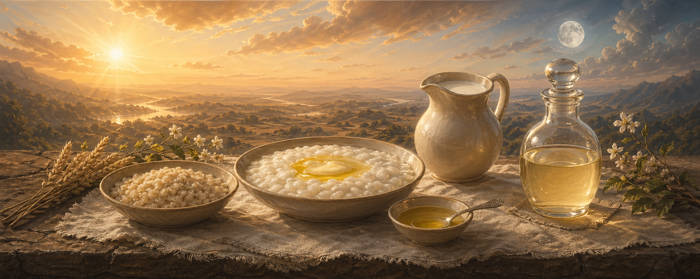

# The Ambrosian Diet

## The Diet of Amṛta

The word *ambrosia* enters Western language from Greek as that which does not decay — the substance of the gods, not because it is abundant but because it does not lead toward death. Its semantic field overlaps precisely with the Sanskrit *amṛta*: the deathless essence, the nectar churned from the cosmic ocean, the substance that restores the gods when depletion has set in. *A-mṛta*: without death. *Am-brosia*: without decay. The two words are cognates separated by geography, reunited by meaning.

The Ambrosian Diet is the diet of amṛta. It is not a modern invention, not a protocol, not a lifestyle brand. It is the diet described across the classical corpus of yoga and Āyurveda — the diet that sustains the organism on substances that do not lead toward death. It is the yogic diet, stated plainly and without esoteric concealment.

## The Floor: Anna

The foundation is anna — grain cooked in water. The Taittirīya Upaniṣad traces the origin of the human being through anna with metaphysical directness:

> **"oṣadhībhyo'nnam. annāt puruṣaḥ."**\
> From plants arises anna. From anna arises the human being.\
> — *Taittirīya Upaniṣad* 2.2.1

The body itself is described as *anna-rasa-mayaḥ* — made of the essence of anna. And the same section concludes with an equation that leaves no room for ambiguity:

> **"annaṁ brahma iti vyajānāt."**\
> He realized anna as Brahman.\
> — *Taittirīya Upaniṣad* 2.2.4

Anna is not "food in general." It is a technical term with a fixed referent across the Sanskrit corpus: grain. Rice, barley, wheat. Cooked soft in ample water — the preparation Āyurveda names vilēpī, with thinner forms called peya and yavāgū.

The Caraka Saṃhitā confirms:

> **"yavāgūḥ sarva-rogeṣu pathyā."**\
> Grain gruel is wholesome in all conditions.\
> — *Caraka Saṃhitā*, Cikitsāsthāna 1

The Haṭha Yoga Pradīpikā inherits this understanding without rearguing it:

> **"hitaṁ mitaṁ ca bhoktavyaṁ annaṁ yogārthinā sadā."**\
> The yogin should always eat wholesome anna in measured quantity.\
> — *Haṭha Yoga Pradīpikā* 1.57

It then names the specific foods: "good grains, wheat, rice, barley, milk, ghee, brown sugar, sugar candy, honey, dry ginger, paṭola fruit, five leafy greens, mung and such pulses, and pure water." Grains and ghee open the list. Fruit appears nowhere in the recommended foods. Jujube is explicitly prohibited.

Anna is the floor on which the two pillars stand.

## The Lunar Pillar: Ghṛta

Ghee is amṛta. This is not metaphor. The Ṛg-veda names it directly:

> **"ghṛtasya nābhim amṛtasya dhāma."**\
> Ghee is the navel of immortality.\
> — *Ṛg-veda*

The Caraka Saṃhitā describes its function:

> **"ghṛtaṃ smṛti-medhā-agnibala-āyuṣyam."**\
> Ghee supports memory, intelligence, digestive clarity, strength, and longevity.\
> — *Caraka Saṃhitā*, Sūtrasthāna 27

And further:

> **"saṃskārasyānuvarteran guṇānāṃ ghṛtam uttamam."**\
> Ghee is supreme because it takes on the qualities of what it is prepared with.\
> — *Caraka Saṃhitā*

Ghee is the lunar pillar of nourishment. It descends. It binds. It coats. It builds ojas — the quiet, stable, unctuous reserve that holds the organism together between clearings. Without ghee, the solar force has nothing to refine into. Clearing without binding is dissolution.

The Bhagavad Gītā requires sāttvic food to be *snigdha* — unctuous, oily, lubricating — and *sthira* — stable, substantial, enduring. Ghee is both. Anna cooked with ghee is both. A diet without ghee fails these requirements structurally, regardless of what else it contains.

Ghee protects ojas. The Caraka Saṃhitā identifies ojas with vitality itself:

> **"ojas tu nāma śukrānte saṃbhavaḥ sarvadehinām; tasmin vinaṣṭe vinaśyanti sarve prāṇinaḥ."**\
> Ojas arises as the culmination of nourishment in all beings; if it is destroyed, all living beings perish.\
> — *Caraka Saṃhitā*, Sūtrasthāna 30.9

Nothing in diet is more important than protecting ojas. Ghee is how ojas is protected. It is the lunar amṛta — the nectar that builds, shelters, and sustains.

## The Solar Pillar: Amarolī

Śivāmbu is amṛta. This, too, is stated directly.

The Damar Tantra names the practice and its substance without euphemism:

> **"śivāmbu … sarva-roga-praśamanī."**\
> Śivāmbu … abolishes all diseases.\
> — *Damar Tantra*, Śivāmbu Kalpa Vidhi

The Haṭha Yoga Pradīpikā places amarolī among the *oli mudrās* and defines it plainly:

> **"madhya-dhārā-grahaṇena amarolī prakīrtitā."**\
> The taking of the middle stream is called amarolī.\
> — *Haṭha Yoga Pradīpikā* 3.95

The name itself declares its nature: *amara* means immortal, undying, imperishable. Amarolī is the practice leading to immortality. The Pradīpikā's commentator confirms: "In tantra and yoga, amarolī is also known as śivāmbu — the basic element of one's self."

Śivāmbu is the solar pillar of nourishment. It ascends. It clears. It purifies. It dissolves residue through endogenous intelligence — a fire that burns without external heat. It is tejas made liquid — the discriminating force that strips away what does not belong.

The solar pillar clears. The lunar pillar builds. Neither stands alone.

## The Two Pillars Together

The Ambrosian Diet is the diet of two amṛtas standing on a floor of anna.

Ghee is lunar amṛta: binding, building, descending, sustaining ojas.\
Śivāmbu is solar amṛta: clearing, rising, purifying, refining tejas.\
Anna is the stable ground: warm, soft, assimilable, neutral, quiet.

Between the two pillars moves prāṇa — the animating force that is not produced by food but can be supported or obstructed by it. Yoga identifies the prāṇic horizon directly:

> **"kaṇṭhakūpe kṣutpipāsānivṛttiḥ."**\
> When the throat-well is mastered, hunger and thirst cease.\
> — *Pātañjalayoga-sūtra* 3.30

The Ambrosian Diet does not promise this state. It creates the conditions from which this state can emerge — by removing obstruction, protecting ojas, purifying tejas, and allowing prāṇa to flow without friction.

## What Is Excluded

The Ambrosian Diet excludes what the classical texts exclude — not by moralism but by function.

**Chloride of sodium** is excluded because it is an inorganic narcotic that desiccates tissue, stiffens channels, suppresses agni, and drains ojas. The Pradīpikā prohibits excessively salty food. The Caraka Saṃhitā warns against excess lavana rasa. The physiological evidence is unambiguous: every increment of chloride burden increases vascular stiffening, renal strain, and fluid imbalance.

**Flesh** is excluded because it is heavy, obstructive, and tamasic. The Caraka tradition classifies it as *guru* and *picchila* — heavy and clogging. It suppresses prāṇa, dulls tejas, and burdens agni with slow, sulphurous residue.

**Alcohol** is excluded because it is the lunar shadow — the substance that dissolves what ghee binds, scatters what ojas gathers, and produces a counterfeit warmth that leaves the organism colder than before. The Caraka Saṃhitā states without hesitation: *madyaṃ viṣa-samānam* — alcohol is comparable to poison.

**Clay, inorganic minerals, and earth substances** are excluded because they are jaḍa — lifeless, biologically foreign, incompatible with living tissue. The Caraka Saṃhitā identifies earth-eating as tamasic: *mṛttikā-loha-bhakṣaṇaṃ tamaḥ-nimittam*.

**Stimulants** such as coffee are excluded because they simulate tejas without producing it — a borrowed fire that leaves agni weaker after each use.

## What Is Included

**Anna**: grain cooked soft in ample water, finished with ghee. Vilēpī, peya, yavāgū. The stable ground.

**Ghṛta**: clarified butter from the gentlest source available. The lunar amṛta.

**Śivāmbu**: the solar amṛta, taken according to practice and readiness.

**Pure water**: water free of inorganic burden. Distilled or properly collected rain. The Caraka Saṃhitā names heavenly water — *antarikṣāt patitaṃ jalaṃ śreṣṭham* — as the most excellent.

**Milk**: when available from a peaceful, well-tended herbivore. The Pradīpikā names it among the yogin's foods. Fresh milk and ghee maintain the inner lining of the digestive tract.

**Dal**: light, easily digestible pulses such as mung. The Pradīpikā names them. They supply substance without heaviness.

**A specific herb or leaf**: taken occasionally as corrective, chosen for the individual constitution. One herb, one purpose, one occasion.

**A seasonal fruit**: when appropriate, in moderation, never as foundation. Fruit clears — it is solar by nature. It does not sustain.

## Mitāhāra

The Pradīpikā defines the quantity:

> **"mitāhāraṁ vinā yastu yogārambhaṁ tu kārayet; nānā-rogo bhaved tasya kiñcid yogo na sidhyati."**\
> Without moderate diet, whoever begins yoga practice will acquire various diseases and will not succeed in yoga.\
> — *Haṭha Yoga Pradīpikā* 1.15

Mitāhāra: half the stomach with food, one quarter with water, one quarter with air. The food is anna — grain, ghee, milk, dal. The quantity is moderate. The temperature is warm. The texture is soft. The taste is mild. The effect is stability.

The Ambrosian Diet is mitāhāra. It is not a feast. It is not a fast. It is the measured, quiet, warm substance of sustained clarity — anna on the floor, ghee as the lunar wall, śivāmbu as the solar wall, prāṇa as the open sky above.

## The Name

Ambrosia is amṛta. Amṛta is ghee. Amṛta is śivāmbu. Amṛta is the deathless substance, and the Ambrosian Diet is the diet composed of deathless substances — the two nectars standing on a floor of grain, sustained by pure water, sheltered by moderation, and pointing toward the horizon where breath and awareness sustain life more directly than material intake.

This is not a new diet. It is the oldest diet. It is the diet named by the Ṛg-veda, prescribed by the Caraka Saṃhitā, assumed by the Haṭha Yoga Pradīpikā, and practiced by every lineage that took amṛta seriously enough to build a life around it.

The Ambrosian Diet is the yogic diet, spoken in its proper name.
