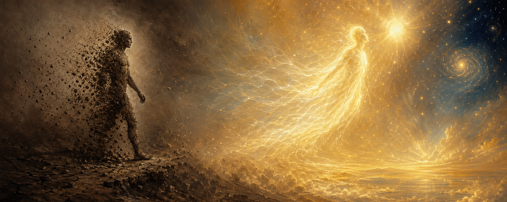

# Physical Mortality and Essential Immortality

> "A mortal man ripens like grain, and like grain he is born again."\
> — *Kaṭha Upaniṣad* 1.1.6

> "Death is not the destruction of things that have been combined but the dissolution of their union. … The body is dissolved and life passes on to the unseen."\
> — *Corpus Hermeticum* XI.15

> "Life is a fleeting event in the eternal flow of energy. Death is what gives it meaning."\
> — don Melchor, in Armando Torres, *The Secret of the Plumed Serpent*

## The doctrine

Three traditions, separated by continents and millennia, arrive at one teaching. The Vedic seers state it in the Upaniṣads. The Greco-Egyptian Hermetists state it in the *Corpus Hermeticum*. The Toltec seers, as transmitted through don Juan to Carlos Castaneda and through Castaneda to Armando Torres, state it in twentieth-century Spanish. Their idioms differ. Their doctrine is the same.

The body is mortal. The body will dissolve. The dissolution is built into the composition. Inside the incarnate life, an essence may be forged that is no part of the body's composition and is therefore no part of the body's dissolution. That essence is the whole point of incarnate life. The window for forging it is the lifetime. After the window closes, there is only whatever has been forged.

The three traditions also converge on the second clause of the teaching: that the search for a *physical* immortality is a confusion. The body is what eats, ages, and returns to earth. Immortality is the property of what was never composed. The discipline of incarnate life is to identify, while alive, with the essence that was never composed, and to take on the habits, perceptions, and silences that belong to it.

This essay gathers the three traditions around those two clauses and quotes them extensively. It makes no case the traditions do not make for themselves.

## The body was given to be dissolved

Ṛgveda 10.90 sets the proportion. The incarnate world is one-fourth of the Puruṣa. The three remaining fourths are always already above. The body is the quarter-part. It was made to end.

> "So mighty is his greatness; yea, greater than this is Puruṣa.\
> All creatures are one-fourth of him, three-fourths eternal life in heaven."\
> — *Ṛgveda* 10.90.3, trans. Griffith

> "With three-fourths Puruṣa went up: one-fourth of him again was here.\
> Thence he strode out to every side over what eats not and what eats."\
> — *Ṛgveda* 10.90.4, trans. Griffith

The *Kaṭha Upaniṣad* puts the grain-image at the front of the whole doctrine. A man ripens. A man falls. A man is sown again. The sequence belongs to the body. The body is grain.

> "A mortal man ripens like grain, and like grain he is born again."\
> — *Kaṭha Upaniṣad* 1.1.6, trans. Olivelle

When Naciketas stands before Yama and is offered every form of long life — sons and grandsons and livestock and gold and "as many autumns as you wish" — he answers with the same recognition the Vedic hymns already carry. The length of the grain's ripening is the grain's business. It is a trifle.

> "Since the passing days of a mortal, O Death,\
> sap here the energy of all the senses;\
> And even a full life is but a trifle;\
> so keep your horses, your songs and dances!"\
> — *Kaṭha Upaniṣad* 1.1.26, trans. Olivelle

> "What mortal man with insight,\
> who has met those that do not die or grow old,\
> himself growing old in this wretched and lowly place,\
> looking at its beauties, its pleasures and joys,\
> would delight in a long life?"\
> — *Kaṭha Upaniṣad* 1.1.28, trans. Olivelle

The *Corpus Hermeticum* restates the mechanism in a physicist's register. Every composite body holds itself together for a time. Every composite body comes apart. Hermes gives the rule in *C.H.* VIII, where the word *dissolution* carries the whole argument.

> "Especially here below, matter has the property of increase and decrease that humans call death. But this disorder arises among things that live on earth; the bodies of heavenly beings have a single order that they got from the father in the beginning. … The recurrence of earthly bodies is the dissolution of their composition, and this dissolution causes them to recur as undissolved bodies — immortal, in other words. Thus arises a loss of awareness but not a destruction of bodies."\
> — *Corpus Hermeticum* VIII.3–4, trans. Copenhaver

The *Asclepius* repeats the teaching in plain voice, addressed to the reader who is still afraid:

> "Death results from the disintegration of a body worn out with work, after the time has passed when the body's members fit into a single mechanism with vital functions. The body dies, in fact, when it can no longer support a person's vital processes. This is death, then: the body's disintegration and the extinction of bodily consciousness. Worrying about it is pointless."\
> — *Asclepius* 27, trans. Copenhaver

The don-Juan line says the same thing with an image. Awareness is a ceaseless swarm of fireflies flying to the beak of an immeasurable black bird. The bird consumes them. This is what happens at the moment of death to every creature that ever lived.

> "The Eagle is devouring the awareness of all the creatures that, alive on earth a moment before and now dead, have floated to the Eagle's beak, like a ceaseless swarm of fireflies, to meet their owner, their reason for having had life. The Eagle disentangles these tiny flames, lays them flat, as a tanner stretches out a hide, and then consumes them; for awareness is the Eagle's food."\
> — Carlos Castaneda, *The Eagle's Gift*

Armando Torres transmits Castaneda's workshop formulation:

> "We are all going to die, and there is no other way. It's only a question of time, so you are already dead: what more is there for you to lose? If we look at things that way, the world is our oyster."\
> — don Melchor, in Torres, *The Secret of the Plumed Serpent*

> "Nobody needs you out there. None of us is so important that it justifies inventing something as fantastic as immortality. A humble sorcerer knows that his destiny is the same as that of any other living being on Earth."\
> — Carlos Castaneda, in Torres, *Encounters with the Nagual*

Three traditions. One statement. The body dissolves because it was composed. Composition carries dissolution the way grain carries the harvest.

## The search for a physical immortality is a confusion

The *Muṇḍaka Upaniṣad* names the particular form of confusion that pursues immortality through sacrifice. Rites bring heavenly enjoyment. Heavenly enjoyment is finite. Its end returns the enjoyer to the wheel of birth and age.

> "Surely, they are floating unanchored,\
> these eighteen forms of the sacrifice,\
> the rites within which are called inferior.\
> The fools who hail that as the best,\
> return once more to old age and death."\
> — *Muṇḍaka Upaniṣad* 1.2.7, trans. Olivelle

> "Wallowing in ignorance time and again,\
> the fools imagine, 'We have reached our aim!'\
> Because of their passion, they do not understand,\
> these people who are given to rites.\
> Therefore, they fall, wretched and forlorn,\
> when their heavenly stay comes to a close."\
> — *Muṇḍaka Upaniṣad* 1.2.9, trans. Olivelle

The single Upaniṣadic sentence that decides the whole case is this one:

> "What's made\
> can't make\
> what is unmade!"\
> — *Muṇḍaka Upaniṣad* 1.2.12, trans. Olivelle

The Toltec tradition has its own version of this error. The old seers of ancient Mexico attempted to carry the physical body through death. They achieved an outcome — a long-lasting, inorganic existence in what Castaneda calls "the dome of the Naguals" — and they paid for it with a slavery that sorcerers of the new cycle refuse. Torres presses Castaneda directly on whether these ancient seers became immortal. Castaneda answers with perfect precision:

> "Does that mean that they became immortal?"\
> "Not at all. What I'm saying is that sorcerers managed to find a way of suspending death, not of cancelling it. For them, to die does not have the same meaning it has for ordinary people. For them, the opposite of dying is not immortality, but continued existence. The trick lies in understanding that to be alive does not necessarily mean being an organism; rather, it means being aware."\
> — Carlos Castaneda, in Torres, *The Secret of the Plumed Serpent*

The ancient Mexican attempt and the Vedic ritualist's attempt are cousins. Both try to extend what was composed. Both are warned against by teachers who walked the further path.

The Hermetic warning is briefer and more final. In the closing dialogue of *C.H.* XIII, Tat asks Hermes whether the new body that replaces the old in the rebirth discourse also dissolves. Hermes rebukes him:

> "Tell me, father, does this body constituted of powers ever succumb to dissolution?"\
> "Hold your tongue; do not give voice to the impossible! Else you will do wrong, and your mind's eye will be profaned. The sensible body of nature is far removed from essential generation. One can be dissolved, but the other is indissoluble; one is mortal, the other immortal."\
> — *Corpus Hermeticum* XIII.14, trans. Copenhaver

Two bodies. Two trajectories. The composite body dissolves. The body of powers does not.

## The essence is forged in life

What is composed is mortal. What was never composed is immortal. The whole discipline of the three traditions is to identify, while alive, with what was never composed.

The Vedic name for it is *ātman*. The *Kaṭha Upaniṣad* gives Yama's final teaching to Naciketas in seven verses. It is the oldest surviving statement of the doctrine in Indo-Aryan.

> "The wise one—\
> he is not born, he does not die;\
> he has not come from anywhere;\
> he has not become anyone.\
> He is unborn and eternal, primeval and everlasting.\
> And he is not killed, when the body is killed."\
> — *Kaṭha Upaniṣad* 2.1.18, trans. Olivelle

> "If the killer thinks that he kills;\
> If the killed thinks that he is killed;\
> Both of them fail to understand.\
> He neither kills, nor is he killed."\
> — *Kaṭha Upaniṣad* 2.1.19, trans. Olivelle

> "Finer than the finest, larger than the largest,\
> is the self (ātman) that lies here hidden\
> in the heart of a living being."\
> — *Kaṭha Upaniṣad* 2.1.20, trans. Olivelle

The same teaching passes through the *Bhagavad Gītā* in a single famous verse:

> "The soul is neither born, nor does it ever die; nor having once existed, does it ever cease to be. The soul is without birth, eternal, immortal, and ageless. It is not destroyed when the body is destroyed."\
> — *Bhagavad Gītā* 2.20

The Hermetic name for it is *nous* — mind, the gift of the father that was dispensed from above into a great mixing bowl and let down to earth as a prize for souls willing to dip. *C.H.* IV is the discourse of the krater.

> "He filled a great mixing bowl with it and sent it below, appointing a herald whom he commanded to make the following proclamation to human hearts: 'Immerse yourself in the mixing bowl if your heart has the strength, if it believes you will rise up again to the one who sent the mixing bowl below, if it recognizes the purpose of your coming to be.' All those who heeded the proclamation and immersed themselves in mind participated in knowledge and became perfect people because they received mind."\
> — *Corpus Hermeticum* IV.4, trans. Copenhaver

> "Those who participate in the gift that comes from god, O Tat, are immortal rather than mortal if one compares their deeds, for in a mind of their own they have comprehended all things on earth, things in heaven and even what lies beyond heaven."\
> — *Corpus Hermeticum* IV.5, trans. Copenhaver

The ritual-discourse of *C.H.* XIII names the composition of the immortal body directly. Twelve punishments — ignorance, grief, incontinence, lust, injustice, greed, deceit, envy, treachery, anger, recklessness, malice — constitute the zodiacal body of the mortal. Ten powers — the gifts of knowledge, joy, continence, perseverance, justice, liberality, truth, the good, life, and light — constitute the body of the immortal. The arrival of the ten expels the twelve. What remains is a body of powers, forged within the incarnate life and conditioned by the life lived there.

> "My child, you have come to know the means of rebirth. The arrival of the decad sets in order a birth of mind that expels the twelve; we have been divinized by this birth. Therefore, whoever through mercy has attained this godly birth and has forsaken bodily sensation recognizes himself as constituted of the intelligibles and rejoices."\
> — *Corpus Hermeticum* XIII.10, trans. Copenhaver

The Toltec name for it is the composed awareness that exercises death's hidden option. Don Juan, in the last book Castaneda wrote, gives the teaching directly:

> "For a sorcerer, death is a unifying factor. Instead of disintegrating the organism, as is ordinarily the case, death unifies it. … Their bodies in their entirety have been turned into energy, energy possessing awareness that is not fragmented. The boundaries that are set up by the organism, boundaries which are broken down by death, are still functioning in the case of sorcerers, although they are no longer visible to the naked eye."\
> — Carlos Castaneda, *The Active Side of Infinity*

The new-cycle sorcerer goes further. The new-cycle sorcerer burns with the fire from within. The composite body is consumed in the exit. The essence travels.

> "They are the warriors of total freedom, that they are such masters of awareness, stalking, and intent that they are not caught by death, like the rest of mortal men, but choose the moment and the way of their departure from this world. At that moment they are consumed by a fire from within and vanish from the face of the earth, free, as if they had never existed."\
> — Carlos Castaneda, *The Fire from Within*

Torres records the same teaching in the plainer voice of the workshop:

> "Warriors of total freedom merge with the emanations at large and disappear forever, consumed by fire from within. … Theirs is truly a journey of no return."\
> — Torres, *The Secret of the Plumed Serpent*

Three names for one essence. The Vedic tradition calls it *ātman*. The Hermetic tradition calls it the body of powers. The Toltec tradition calls it the unified awareness that exercises death's hidden option. In each case the essence was never composed. In each case the essence is identified with, cleaned, and strengthened during the life. In each case the strengthened essence is what survives the dissolution.

## Life is the window

The essence is forged while the body lives. This is the point on which all three traditions are most emphatic and most practical.

The *Kaṭha Upaniṣad* gives the image of the razor's edge and a single imperative:

> "Arise! Awake! Pay attention,\
> when you've obtained your wishes!\
> A razor's sharp edge is hard to cross—\
> that, poets say, is the difficulty of the path."\
> — *Kaṭha Upaniṣad* 1.3.14, trans. Olivelle

The *Muṇḍaka Upaniṣad* prescribes the immediate response to recognizing the situation:

> "When he perceives the worlds as built with rites,\
> A Brahmin should acquire a sense of disgust — \
> 'What's made can't make what is unmade!'\
> To understand it he must go, firewood in hand,\
> to a teacher well versed in the Vedas,\
> and focused on brahman."\
> — *Muṇḍaka Upaniṣad* 1.2.12–13, trans. Olivelle

The Hermetic imperative is to take on, during life, the awareness appropriate to what one intends to become. Hermes gives Trismegistus this instruction in *C.H.* XI:

> "Unless you make yourself equal to god, you cannot understand god; like is understood by like. Make yourself grow to immeasurable immensity, outleap all body, outstrip all time, become eternity and you will understand god. Having conceived that nothing is impossible to you, consider yourself immortal and able to understand everything, all art, all learning, the temper of every living thing."\
> — *Corpus Hermeticum* XI.20, trans. Copenhaver

Poimandres addresses the same instruction, in the first discourse, directly to the living:

> "Why have you surrendered yourselves to death, earthborn men, since you have the right to share in immortality? You who have journeyed with error, who have partnered with ignorance, think again: escape the shadowy light; leave corruption behind and take a share in immortality."\
> — *Corpus Hermeticum* I.28, trans. Copenhaver

The Toltec prescription is the same prescription in late-modern Spanish: the awareness of death, held at arm's length through the whole of life, is the force that composes the essence.

> "If you want to know yourselves, be aware of your personal death. It's not negotiable, it is the only thing that you can seriously own. Everything else may fail, but not death, you can take that as a fact. Learn how to use it to produce real effects in your lives."\
> — Carlos Castaneda, in Torres, *Encounters with the Nagual*

> "In a world where death is the hunter, there is no time for regrets or doubts. There are only decisions."\
> — Carlos Castaneda, *Journey to Ixtlan*

> "The idea of death is the only thing that can give sorcerers the courage to do what they do."\
> — Carlos Castaneda, *The Wheel of Time*

The mechanism by which the Toltec tradition composes the essence is called the *recapitulation*. The apprentice remembers every event of the life, retrieves the energy left in each one, and folds that energy back into the travelling self. At the moment of the definitive journey, the essence that crosses is the essence that has been gathered. Nothing is left behind that was not deliberately left.

> "This is a prison world, and we must leave it as fugitives; we can't take anything with us. Human beings are travelers by nature. To fly and to know other horizons is our destiny."\
> — Carlos Castaneda, in Torres, *Encounters with the Nagual*

The Hermetic *Asclepius* closes with a clause that states the connection between the life and the essence in the cleanest surviving form:

> "When he has seen the light of reason as if with his eyes, every good person is enlightened by fidelity, reverence, wisdom, worship and respect for god, and the confidence of his belief puts him as far from humanity as the sun outshines the stars."\
> — *Asclepius* 29, trans. Copenhaver

The sun-and-stars image is identical across the three corpora. The *Kaṭha* gives it as the knower whose knowledge places him beyond the jaws of death. The Hermetic text gives it as the good person whose confidence in the light puts him as far above humanity as the sun above the stars. The don-Juan line gives it as the warrior who passes, with the totality of their being, through the opening in the cosmic wall. In each case the transformation is completed during the life. After the life, there is only the journey.

## The three names of the essence

*Ātman.* The self that is finer than the finest and larger than the largest, hidden in the heart of a living being, unborn and undying, not slain when the body is slain. The Upaniṣadic seers hand it down.

*The body of powers.* The composition of the ten that replaces the composition of the twelve — knowledge, joy, continence, perseverance, justice, liberality, truth, the good, life, and light. Indissoluble, because it was never composed of the elements that dissolve. The Hermetic tradition hands it down.

*Unified awareness.* The totality of a disciplined life, gathered into one bundle by the recapitulation and the stalking of the person, unified further by the fire from within at the moment of the exit. The Toltec tradition hands it down.

The idioms belong to three worlds. The doctrine belongs to one. The body is the grain, the composite, the firefly. The essence is the ātman, the body of powers, the unified awareness. The window is the lifetime. The discipline is the discipline of the lifetime. The crossing is the crossing the composite body cannot make.

## Salutation

To the grain that ripens and falls. To the composite that holds for a season and comes apart. To the firefly that flies to the beak. And to the ātman that is not slain when the body is slain; to the body of powers that is not dissolved when the body of elements is dissolved; to the awareness that walks through the opening with the totality of the life it gathered — the one essence the three traditions name with three names, composed in the body, sheltered by the body, and outlasting the body by the whole of its remaining arc.

> "When a man perceives it, fixed and beyond the immense, He is freed from the jaws of death."\
> — *Kaṭha Upaniṣad* 1.3.15, trans. Olivelle

> "This is the final good for those who have received knowledge: to be made god."\
> — *Corpus Hermeticum* I.26, trans. Copenhaver

> "Death is the gateway to infinity. A door made to the exact measure of each of us, which we will all pass through someday, returning to our origin."\
> — Carlos Castaneda, in Torres, *Encounters with the Nagual*
