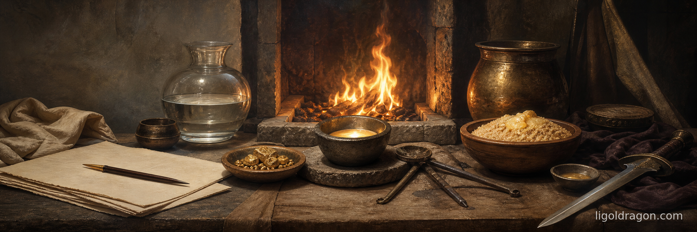

# Refinement

*The Refiner's Fire*

In every tradition that has thought seriously about what a human being is meant to do with himself, the same image returns. The practitioner is a smith. The material is a metal. The fire is the slow patient agent that does the work neither of them could do alone.

> **anupubbena medhāvī thokaṃ thokaṃ khaṇe khaṇe |**\
> **kammāro rajatass'eva niddhame malam attano ||**
>
> "Step by step, little by little, moment by moment — as the smith refines silver, the wise removes his own impurity."\
> — *Dhammapada* 239

The metal enters the fire as ore. The metal leaves the fire as silver. The fire's whole work is to remove what was not silver. This is the picture the old corpora keep returning to, and it is the picture this article holds steady in for the length of its reading.

## Fire Tests Gold

The Romans named it most curtly. Seneca writing to Lucilius:

> **ignis aurum probat, miseria fortes viros.**
>
> "Fire tests gold; misery tests strong men."\
> — Seneca, *De Providentia* V.10

The Hebrew Bible had said it a thousand years before, in the proverb of the king who saw clearly:

> "The fining pot is for silver, and the furnace for gold;\
> but the LORD trieth the hearts."\
> — *Proverbs* 17:3

The image is the same. The metal is impure when it enters the fire. The metal is silver when it leaves. The fire's work is to remove what was not the metal. Job, suffering, gave the practitioner's answer in the first person:

> "When he hath tried me, I shall come forth as gold."\
> — *Job* 23:10

The friction is the friend. What feels like ruin is the dross being drawn off. The strong man — the *fortis vir* of Seneca — is the one who has consented to the heat.

## The Substrate

Heraclitus, watching the same flame from Ionia some five centuries before Seneca, named the underlying physics:

> **κόσμον τόνδε, τὸν αὐτὸν ἁπάντων, οὔτε τις θεῶν οὔτε ἀνθρώπων ἐποίησεν, ἀλλ' ἦν ἀεὶ καὶ ἔστιν καὶ ἔσται πῦρ ἀείζωον, ἁπτόμενον μέτρα καὶ ἀποσβεννύμενον μέτρα.**\
> *kosmon tonde, ton auton hapantōn, oute tis theōn oute anthrōpōn epoiēsen, all' ēn aei kai estin kai estai pyr aeizōon, haptomenon metra kai aposbennymenon metra.*
>
> "This world-order, the same for all, no god or man made; it ever was and is and will be: an everliving fire, kindling in measures and going out in measures."\
> — Heraclitus, fragment DK B30

The cosmos is the forge. Living in it well is a matter of measure. Too little heat and the metal stays as ore; too much and the metal cremates. The smith chooses the measure; the fire is given. Heraclitus left another fragment that names the same fire as a currency:

> **πυρός τε ἀνταμοιβὴ τὰ πάντα καὶ πῦρ ἁπάντων ὅκωσπερ χρυσοῦ χρήματα καὶ χρημάτων χρυσός.**\
> *pyros te antamoibē ta panta kai pyr hapantōn hokōsper chrysou chrēmata kai chrēmatōn chrysos.*
>
> "All things are an exchange for fire, and fire for all, as gold is for goods and goods for gold."\
> — Heraclitus, fragment DK B90

Fire is the coin in which the cosmos transacts. The smith standing at his bellows is the cosmos in miniature. To live is to convert one's own substance through fire into something other than what came in.

## The Refiner Sits

The most patient version of the picture comes from Malachi, who saw the work as taking time and saw the worker as seated:

> "For he is like a refiner's fire, and like fullers' soap.\
> And he shall sit as a refiner and purifier of silver:\
> and he shall purify the sons of Levi, and purge them as gold and silver,\
> that they may offer unto the LORD an offering in righteousness."\
> — *Malachi* 3:2-3

*He shall sit as a refiner.* The refiner holds the silver in the fire long enough to bring the dross to the surface. He draws it off. He returns the silver. He waits. He draws off again. The old test was to watch the surface of the molten metal until he could see his own face reflected in it. When the silver mirrored the refiner's face, the work was done.

The image is the structure of every discipline. The cook sits at his pot. The yogi sits at his breath. The writer sits at his sentence. The warrior sits in his readiness. The patience *is* the work.

## The Fire Within

The Bhagavad Gītā moves the same image inside the body. Kṛṣṇa says to Arjuna:

> **yathaidhāṃsi samiddho 'gnir bhasma-sāt kurute 'rjuna |**\
> **jñānāgniḥ sarva-karmāṇi bhasma-sāt kurute tathā ||**
>
> "As a kindled fire reduces firewood to ashes, Arjuna,\
> so the fire of knowledge reduces all karma to ashes."\
> — *Bhagavad Gītā* 4.37

The metal here is the practitioner himself. The dross is his accumulated karma — the residues of past action that hold him to forms he has outgrown. The fire is the burning recognition that this dross is no longer him. The *jñānāgni* is the inner refiner's fire — the same forge moved into the chest of the man on the chariot.

Āyurveda gives the digestive variation. *Agni* in the belly converts food into the seven tissues; the seven tissues converge into *ojas*; *ojas* feeds *prāṇa*. The body is a smithy. The cooked grain is the ore. The hearth-fire is one fire, and the belly-fire is the same fire moved inside the eater.

The smith's image, in many languages, names a single fact about being alive: a human being is matter that has consented to be heated until something other than ore comes out.

## The Warrior's Mood

The smith works in a particular mood. The mood is steady — the mood of a man who has accepted that the work is the work. Don Juan named it for Castaneda:

> "The basic difference between an ordinary man and a warrior is that a warrior takes everything as a challenge, while an ordinary man takes everything as a blessing or a curse."\
> — Carlos Castaneda, *Journey to Ixtlan*

The ordinary man at the forge calls the heat a curse and the cool metal a blessing. The warrior at the same forge calls the heat the work. The hand on the bellows is steady because the hand has stopped asking whether the heat ought to be there.

Marcus Aurelius, the Roman emperor who wrote his journal in Greek between campaigns, gave himself the same instruction every morning:

> **ὄρθρου, ὅταν δυσόκνως ἐξεγείρῃ, πρόχειρον ἔστω ὅτι ἐπὶ ἀνθρώπου ἔργον ἐγείρομαι.**\
> *orthrou, hotan dusoknōs exegeirē, procheiron estō hoti epi anthrōpou ergon egeiromai.*
>
> "At dawn, when waking is hard, have this thought ready: I am rising to do the work of a human being."\
> — Marcus Aurelius, *Meditations* V.1

The work of a human being is the work of the silver in the fire. To be human is to consent to the heat day after day. The emperor reminds himself at dawn because at dawn the consent is hardest. At dawn the cool bed is the blessing-or-curse posture, and the work at the forge is the challenge posture.

## The Daily Heats

Musashi, in seventeenth-century Edo, gave the practitioner the time-scale:

> **千日の稽古を鍛とし、万日の稽古を錬とす。**\
> *sennichi no keiko o tan to shi, mannichi no keiko o ren to su.*
>
> "A thousand days of practice is the forging; ten thousand days of practice is the tempering."\
> — Miyamoto Musashi, *Book of Five Rings*, Earth Scroll

*Tanren* — forging and tempering. The first thousand days make the blade; the next ten thousand make it true. The smith's work is finished only by accumulation. The Buddha said the same in the verse that names the four crafts:

> **udakaṃ hi nayanti nettikā, usukārā namayanti tejanaṃ |**\
> **dāruṃ namayanti tacchakā, attānaṃ damayanti paṇḍitā ||**
>
> "Irrigators direct the water; fletchers shape the arrow; carpenters bend the wood; the wise shape themselves."\
> — *Dhammapada* 80

The fletcher holds the arrow to a small flame, eases it straight, lets it cool, holds it again. The carpenter draws the plane across the beam many times. The irrigator opens the channel a little at a time. The wise man refines himself the same way: by consenting, again and again, day after day, to the fire that was already burning when he arrived.

## Closing

The smith does not invent the silver. The silver is in the ore from the beginning. The smith only removes what is not the silver. This is the old picture, and it is the same picture in every old place: in the smithy where Heraclitus watched the flames; in the Levitical temple where the silver of the priests was tested; on the battlefield where the warrior of the *Gītā* learned to burn his karma to ash; in the dōjō where Musashi forged for a thousand days and tempered for ten thousand; in the kitchen where the householder this morning lit his fire and set on the pot.

> **今日は昨日の我が身に勝ち。**\
> *kyō wa kinō no waga mi ni kachi.*
>
> "Today, the victory over the self of yesterday."\
> — Miyamoto Musashi, *Book of Five Rings*, Earth Scroll

The forge is lit. The silver is in the fire. The refiner sits. The dross will come up. The metal will speak when it is ready.

This is the old work.
