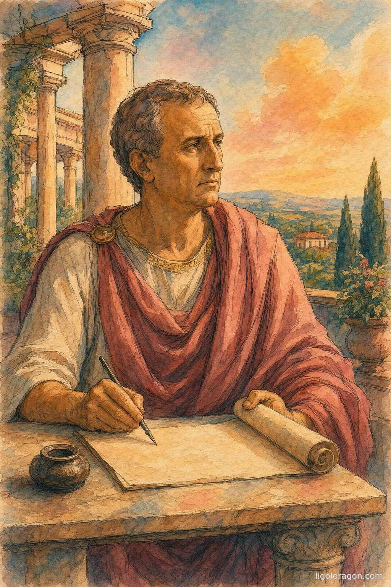

# A Court Against Justice

When God offered Solomon anything he asked, the young king did not ask for the wealth of his people. He asked for *an understanding heart... that I may discern between good and bad* (1 Kings 3:9). And when two women came before him, each claiming one living child, he did not improve the child, or divide it, or hand the loser a consolation. He gave the child to the woman it belonged to, and forbade anyone to harm it. He created nothing and distributed nothing. He discerned whose it was, and returned it. That is the whole of a court's office: not to make a people prosper, but to tell, between two claims, which is just — and to restore to each what is already his.

There is only one justice, and this is it. The oldest law we have states it in two strokes: *alterum non laedere, suum cuique tribuere* — injure no one, and render to each his own. Cicero put the court's first duty the same way: the first office of justice is *to keep one man from doing harm to another.* Justice is protection. It stands between the man who builds and the man who would take from him by force or fraud, and it guards the builder — whether or not he builds well, whether or not he builds at all. It secures the field. It does not plant it, and it does not parcel out the harvest.

Aristotle is the one who muddied this, and it is worth seeing exactly how. He cut justice in two: a *corrective* justice that rights wrongs between man and man — the court's true work — and a *distributive* justice that portions out "honour or money" among the members of a city. The first is justice. The second is a counterfeit, and Aristotle should have caught it, because he had refuted it himself a book earlier. Good giving, he says there, is not a species of justice at all but a private virtue — *liberality* — and the liberal man gives *from his own possessions.* That is the hinge of the entire matter. Giving is real, and giving is good. But it is the act of an owner over what is his.

Scripture is plainer still. When Ananias laid a gift at the apostles' feet but lied about the amount, Peter did not fault him for holding part back. He said: *was it not thine own? and after it was sold, was it not in thine own power?* The land was his to give or to keep; the sin was the lie, not the keeping. A gift is the free disposal of one's own. It is why Paul says to give *not grudgingly, or of necessity: for God loveth a cheerful giver* — a transfer squeezed out by necessity is not a gift. Seneca reached the same place from pagan premises: a benefit *exists, not in that which is done or given, but in the mind of the doer or giver.* Remove the giver's free will and you do not have a smaller gift. You have no gift at all.

So the thing that calls itself distributive justice is a theft with a certificate. Bastiat gave the test in one line: *see if the law takes from some persons what belongs to them, and gives it to other persons to whom it does not belong.* Where it does, it has not invented a newer and kinder justice; it has done the precise wrong that justice exists to prevent, and pinned justice's name to the wrong. Isaiah cursed it long before there was an economy to argue over: *Woe unto them that decree unrighteous decrees... to take away the right.* Robbery dressed as relief is the oldest of the frauds, and a court that commits it has become the thing your own instinct named — a court against justice.

Someone will answer that the distribution buys a greater prosperity, that the loss is repaid many times over. But no one can measure such a thing. The loss is certain — one man's, exact and present — and the prosperity is only a forecast: as the Preacher said, *thou knowest not whether shall prosper, either this or that.* To take what is real on the strength of what cannot be known is not to weigh a gain against a loss. It is to inflict a sure wrong for the sake of a guess, and to call the guess a profit.

Every court stands beneath a law it did not write. Twenty centuries before our statutes, Cicero named it and let it thunder: *"True law is right reason in agreement with nature; it is of universal application, unchanging and everlasting… It is a sin to try to alter this law, nor is it allowable to attempt to repeal any part of it, and it is impossible to abolish it entirely. We cannot be freed from its obligations by senate or people…"* No senate, then; no people; no bench. A judge's authority is borrowed from that older law and never owned, and every human statute is only a copy of it, faithful or corrupt. That is the whole measure of a law's legitimacy: not that it was passed, not that it was kindly meant, but that it answers to the higher law it did not author. Aquinas drew the line and left no soft edge on it: *"…every human law has just so much of the nature of law as it is derived from the law of nature. But if in any point it deflects from the law of nature, it is no longer a law but a perversion of law."* A decree that commands what natural justice forbids — that takes one man's own and hands it to another — is not made weightier by being written down. It is not a sterner law. It is a perversion of law: force in the robes of one.

So the court keeps to the discerning heart, and to nothing past it. It does not fear the face of man, *for the judgment is God's.* It does not *respect the person of the poor, nor honour the person of the mighty.* It renders each his own and protects the peace — and it leaves giving where giving lives: with owners, who alone have anything to give, and who give freely, or not at all.
