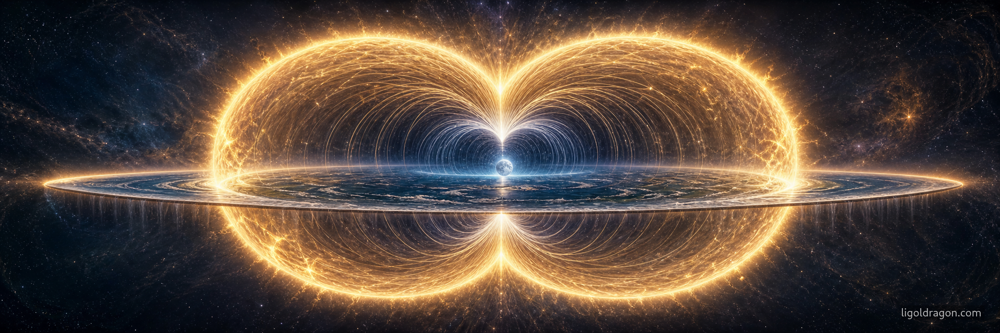

# The Toroidal Heart

*Two Lights, One Pulse*

The world is a torus. The level earth-disk lies within it. The north pole is at the center of the disk; the equator is a circle drawn around that center; the southern lands fill the disk's periphery. The torus is shaped around a central axis perpendicular to the disk, rising through the north pole. The hemispheres of the torus are not above and below the disk — they are inner and outer. The inner hemisphere, north, is gathered around the central axis: the core. The outer hemisphere, south, spreads across the disk's periphery: the skin. The Sun and the Moon are the two driving Lights. Both move through the toroidal field, in and out of the core and across the skin. The Sun keeps to the ecliptic; the Moon weaves above and below it. At any moment, the Light that stands more north — closer to the core — is the dominant Light. The lunar nodes mark where the dominance changes hands.

> **एकं सद् विप्रा बहुधा वदन्ति।**\
> *ekaṃ sad viprā bahudhā vadanti.*
>
> "Truth is one; the sages call it by many names."\
> — *Ṛgveda* 1.164.46

This is the picture this article holds steady in for the length of its reading.

## The Field

The torus is the natural shape of any self-organizing field. Plasma confines itself into a doughnut. The heart's magnetic field draws a torus around the chest. The Earth's magnetosphere flares out from the poles and folds back across the equator. The cosmos in which the body is embedded is one such field, set in continuous circulation around a stable center.

> "He fixed the earth firm, and set the sky in motion."\
> — *Ṛgveda* 10.149.1

> "This Earth is the bearer; all beings rest upon her. Upon her the paths of the Sun are laid."\
> — *Atharva Veda* 12.1.1; 12.1.12

The body stands on the level disk. From wherever it stands, the direction north is the direction toward the disk's center, and south the direction toward its periphery. The toroidal field rises around the central axis above the north pole and folds back through the outer skin out beyond the southern fringe. The inner ring is the core where the field gathers; the outer ring is the skin where it spreads. The whole field is one surface, breathing.

> **κόσμον τόνδε, τὸν αὐτὸν ἁπάντων, οὔτε τις θεῶν οὔτε ἀνθρώπων ἐποίησεν, ἀλλ' ἦν ἀεὶ καὶ ἔστιν καὶ ἔσται πῦρ ἀείζωον, ἁπτόμενον μέτρα καὶ ἀποσβεννύμενον μέτρα.**\
> *kosmon tonde, ton auton hapantōn, oute tis theōn oute anthrōpōn epoiēsen, all' ēn aei kai estin kai estai pyr aeizōon, haptomenon metra kai aposbennymenon metra.*
>
> "This world-order, the same for all, no god or man made; it ever was and is and will be: an everliving fire, kindling in measures and going out in measures."\
> — Heraclitus, fragment DK B30

Measure is the key word. The fire that kindles and goes out is a fire that takes turns with itself: the in-breath toward the core, the out-breath across the skin. The cosmos is the bellows.

## The Inner Core, The Outer Skin

The torus has a radial asymmetry. Its inner ring is small and dense; its outer ring is wide and diffuse. The field-lines pack into the central axis like threads gathered into a knot, then loosen across the outer surface like fabric draped over a body. Northward is the direction toward the central axis. Southward is the direction away from it. North is concentrated. South is dispersed. Whatever is northernmost is closest to the core, and so dominates. South is the diffuse periphery — present, but subtle.

The main current flows from above-center to below-center: down the central axis from the upper apex through the disk's north pole into the lower apex below. The underworld runs the same toroidal circulation as the upper world, with the energetic movement inverted — from periphery to center where the upper went center to periphery. Currents go both ways at every scale; the main direction binds the cosmos.

This asymmetry is what the seasonal year carries on its back. The sun's annual circle of motion above the disk contracts in summer and expands in winter. In summer the sun draws inward toward the central axis, and the days lengthen; in winter it sweeps outward toward the southern fringe, and the days shorten. At summer solstice the sun rides its innermost ring, the Tropic of Cancer; at winter solstice its outermost, the Tropic of Capricorn.

> "From the equinox the Sun proceeds northward; when he reaches the extreme of that northern course and turns back, that place is Cancer. From the equinox he proceeds southward; when he reaches the extreme of that southern course and turns back, that place is Capricorn."\
> — *Sūrya Siddhānta* I.12–13

The turning points are not arbitrary. They are the moments when the sun's radial motion inverts. Cancer is the inner door, where the sun stops drawing closer to the axis and turns back out. Capricorn is the outer door, where the sun stops drawing away and turns back in. The two cardinal axes — equinoctial belt and solstitial axis — divide the toroidal field into four quadrants and the year into four seasons.

## The Two Lights

The Sun and the Moon are the field's two driving Lights. Their natures are given in the oldest statement of cosmogenesis:

> **चन्द्रमा मनसो जातश्चक्षोः सूर्यो अजायत।**\
> *candramā manaso jātaś cakṣoḥ sūryo ajāyata.*
>
> "From his mind the Moon was born; from his eye, the Sun."\
> — *Ṛgveda* 10.90.13

The eye looks outward. The mind turns inward. The Sun is the Light by which we see what is outside — radiant, public, manifest. The Moon is the Light by which we know what is inside — reflective, hidden, gathered. The two natures incline in opposite directions, but neither Light is fixed to one hemisphere. Both move through the toroidal field. The dominance between them is decided not by what each Light is, but by where each Light stands.

Plutarch, writing on the face in the moon, gave the geometry its earliest doctrinal name:

> "The half of the moon that faces heaven is the Elysian plain; the half that faces earth is the house of counter-earth Persephone."\
> — Plutarch, *De facie quae in orbe lunae apparet* 944C

The Moon, in her two-facedness, witnesses the duality of the field directly — one face turned toward the heavens, the other toward the disk. The Bhagavad Gītā names the two Lights together as one luminosity:

> **यदादित्यगतं तेजो जगद्भासयतेऽखिलम्।**\
> **यच्चन्द्रमसि यच्चाग्नौ तत्तेजो विद्धि मामकम्॥**\
> *yad āditya-gataṃ tejo jagad bhāsayate 'khilam |*\
> *yac candramasi yac cāgnau tat tejo viddhi māmakam ||*
>
> "That light which, residing in the sun, illumines the whole world, that which is in the moon and that which is in fire — that light know to be mine."\
> — *Bhagavad Gītā* 15.12

One light, two Lights. Form differentiates; substance unifies. The Sun and the Moon are two phases of one luminosity, weaving through the field.

## Day-force, Night-force

Rudhyar named the pulse:

> "The Day-force is a personalizing energy. It forces ideas, spiritual entities, abstractions into concrete and particular actuality... The Night-force is an in-gathering energy. It brings personalities together."\
> — Dane Rudhyar, *The Pulse of Life*

The Day-force is the personalizing impulse: spirit becoming form, the diffuse becoming particular, the abstract becoming individual. It grows in strength as the sun makes its inward turn — from winter solstice through spring to summer, from the outer ring of Capricorn through the equator to the inner ring of Cancer. The Night-force is the collectivizing impulse: form becoming community, the individual becoming public, the particular becoming general. It grows in strength as the sun makes its outward turn — from summer through autumn back to winter.

> "Reality has a rhythmic heart. The systole and diastole of that heart create these beats of becoming which are birth and death, winter and summer, increase of light and crescendos of darkness."\
> — Dane Rudhyar, *The Pulse of Life*

The two phases are halves of one breath, twelve months long. The Day-force is the year's diastole: the inward gathering of spirit into individual form. The Night-force is the year's systole: the outward extension of the individual into wider wholes. Both forces operate at every moment of every day, but one is louder at a time.

Within this annual breath runs a finer rhythm: the monthly alternation of the Two Lights themselves.

## The Nodes as Doors

The Sun keeps to the ecliptic — his own annual path. The Moon's orbit tilts five degrees off the ecliptic, so twice each month her path crosses the Sun's. The two crossings have names. Rāhu, the ascending node, is the head: the door where the Moon's orbit crosses from south of the ecliptic to north. Ketu, the descending node, is the tail: the door where her orbit crosses from north of the ecliptic to south. From these two doors the alternation of solar and lunar dominance is read.

Between Rāhu and Ketu — the half-orbit when the Moon stands north of the ecliptic — the Moon is more north than the Sun. The Moon is closer to the core. The Moon dominates the field.

Between Ketu and Rāhu — the half-orbit when the Moon stands south of the ecliptic — the Sun, keeping to the ecliptic, is more north than the Moon. The Sun is closer to the core. The Sun dominates.

Rāhu is the door through which the Moon enters her dominance. Ketu is the door through which the Sun enters his. The two doors are crossed every 27.2 days — the draconic month — as the Moon completes one circuit of her own nodal cycle.

Eclipse season is the moment when both Lights converge on the same nodal axis. New moon at Rāhu or Ketu: Sun and Moon at the same longitude, both at the ecliptic — a solar eclipse, the field's whole hinge swung at once. Full moon with Sun at one node and Moon at the other: a lunar eclipse, the field maximally polarized. What classical astrology has named malefics — Rāhu and Ketu — are in this geometry the gates through which dominance changes hands.

> "The motions once finished are again begun in the same order."\
> — *Sūrya Siddhānta* I.13

The nodal axis precesses backward through the zodiac at roughly nineteen degrees a year, completing a full circuit in eighteen and a half years. The body's eighteen-year cycles — the wisdom-tooth eruption, the early-twenties consolidation, the late-thirties pivot, the mid-fifties harvest — are nodal cycles felt from inside the body.

## The Arc Through the Torus

Arthur Young, working from Eddington's unification of relativity and quantum theory, gave the closed cosmos its formal name:

> "3/4 × 2π × 4/3 πR³ = 2π²R³ — which is the formula for the Einstein-Eddington hypersphere. It is also the formula for the torus with an infinitely small hole."\
> — Arthur M. Young, *Science and Astrology*

The cosmos is a torus with a vanishing throat. The arc through it is sevenfold: four steps forward, three steps back. Four steps of descent through the outer skin into matter; the turn at the bottom; three steps of return through the inner core to spirit.

> "The pattern is seven-fold: four steps forward (learning), three steps back (application). All other skills have this 'anatomy,' involving seven distinct steps, which begin and end with spontaneous action."\
> — Arthur M. Young, *Science and Astrology*

The cardinal cross marks the four hinges. The fixed signs name the embodied phases; the mutables name the relational ones. The twelve signs are twelve cross-sections of one toroidal arc. The whole cycle is one inhalation and one exhalation of the field.

> **ὁδὸς ἄνω κάτω μία καὶ ὡυτή.**\
> *hodos anō katō mia kai hōutē.*
>
> "The way up and the way down are one and the same."\
> — Heraclitus, fragment DK B60

The descent through the skin and the return through the core are one motion. The torus closes back on itself. The arc is a circuit.

## The Twelve Phases

> "That wheel with twelve spokes revolves around the sky of *ṛta*."\
> — *Ṛgveda* 1.164.12

The twelve signs articulate the toroidal flow. Each is a measure-formula in the language of physics and a phase of becoming in the language of life — twelve cross-sections of one closed motion. Each names a moment at which the Day-force or the Night-force is locally most expressed, in a specific quality and a specific phase.

The cardinal signs are the four doors of the field. Aries the door of impulse, where the Day-force begins its outrush. Cancer the door of reception, where the Day-force reaches its summit and turns. Libra the door of relation, where the Night-force begins its in-gathering. Capricorn the door of structure, where the Night-force reaches its base and turns. Four doors, four turns, one cycle. The fixed signs are the embodiments of each quadrant. The mutables are its mediations. The twelve together are not categories of person but stations of the breath.

## Nested Tori

The torus is not the cosmos's only torus. Rudhyar named the principle:

> "What I had earlier called the principle of 'holism' I now realized was better named 'holarchy' — for what we are dealing with is a hierarchy of wholes, each whole nested within a larger whole, each acting upon the wholes within it and reacting to the wholes that contain it."\
> — Dane Rudhyar, *The Astrology of Transformation*

The cell is a torus. The body is a torus. The world the body inhabits — the level disk and its surrounding sky together — is a torus. The solar system is a torus, and the galaxy is one larger torus that holds it. Each scale has its own core and its own skin, its own equatorial plane, its own Two Lights. The cell has its nucleus for a core and its membrane for a skin. The body has its heart for a core and its skin for a skin. The world has the central axis rising through the north pole for its core and the encircling southern firmament for its skin. The solar system has the sun for a core and the heliopause for a skin.

Astrology is the science of the nested tori. The natal chart locates an individual body's core-and-skin within the world's core-and-skin within the solar system's core-and-skin — three scales pulsing in resonance, three Two-Lights breathing the same Day-force and Night-force at three scales at once. To read a chart is to feel one's location in the nested breath.

> "The light that resides in the sun and that illumines the whole world, the light that is in the moon and in fire — know that light to be mine."\
> — *Bhagavad Gītā* 15.12

The light is one. The scales are many. The breath at every scale is the same breath.

## The Practical Attitude

To live the field is to know which way it is pulsing. In the morning, with the sun rising on the eastern horizon and the moon somewhere on her own orbit, the body is at a particular place in the nested breath. Some hours the field is in-gathering, some hours it is radiating. Half the lunar month the Moon stands north of the Sun and her dominance fills the field; the other half the Sun stands more north and his dominance prevails. Some years the nodal axis has placed Rāhu in one sign and Ketu in another, charging certain doors and quieting others.

The sage does not consult an ephemeris for permission. The sage feels the pulse and acts with it.

> "Gloriously, the dance of experience moves on in the hallways of nature's cycle. The Sage looks on, yet every phase of the dance pulsates through his awareness. He is spectator, yet he is partner to all protagonists in the universal dance."\
> — Dane Rudhyar, *The Pulse of Life*

Astrology on the toroidal reading is the grammar of the field. The body that knows the field can live by it without consulting any chart. The chart helps when the body's reading is uncertain, the same way a tuning fork helps an ear that has lost its pitch. The fork is calibration; the ear is the instrument.

> "Astrology does not predict 'events' but only phases in a person's development."\
> — Dane Rudhyar, *The Practice of Astrology*

The chart is a symbol; the body is the witness; the field is the source.

## Closing

The world is a torus. The core dominates the skin because the core is dense and the skin is diffuse. The two Lights move through both hemispheres; whichever is more north dominates. Between Rāhu and Ketu the Moon stands more north and rules; between Ketu and Rāhu the Sun stands more north and rules. The wheel turns with twelve spokes around the sky of *ṛta*. The field breathes systole and diastole. The body, standing on the level earth, breathes with it.

> "The Sun is the soul of all that moves and all that rests."\
> — *Ṛgveda* 1.115.1

The field is one. The Lights are two. The breath is one. The body is at home.
